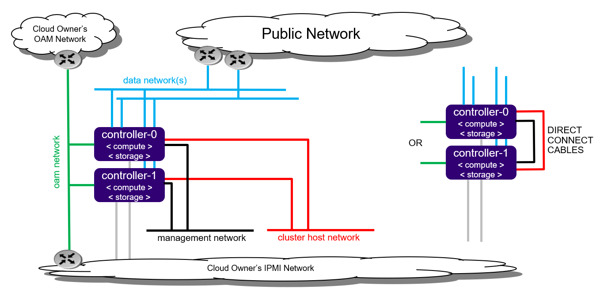
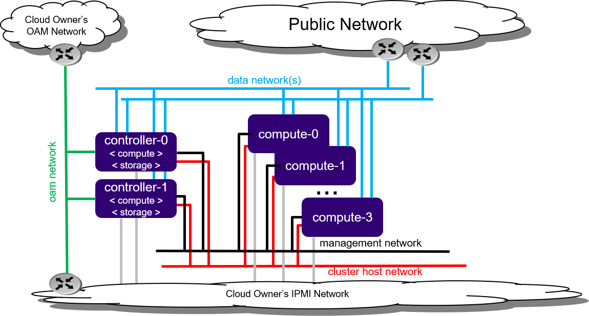

# All-in-One Duplex (AIO-DX)

## Tổng quan

All-in-One Duplex (AIO-DX) là mô hình triển khai StarlingX với **2 controller node**, mỗi node đồng thời đảm nhiệm:

* Controller
* Compute
* Storage

Mô hình này hỗ trợ **High Availability (HA)** và phù hợp cho các Edge Site yêu cầu độ sẵn sàng cao.

---

## Kiến trúc AIO-Duplex

*Hình 1. Kiến trúc All-in-One Duplex với hai controller node.*

### Đặc điểm

* 2 node controller hoạt động HA.
* Mỗi node đồng thời chạy Controller, Compute và Storage.
* Kết nối thông qua:

    * OAM Network
    * Data Network
    * Cluster Host Network
    * IPMI Network

---

## Mở rộng năng lực AIO-Duplex

AIO-Duplex có thể được mở rộng bằng cách bổ sung các **Compute Node** để tăng tài nguyên xử lý mà vẫn giữ nguyên cụm Controller HA.

*Hình 2. Mở rộng AIO-Duplex bằng cách bổ sung Compute Node.*

### Lợi ích

* Tăng CPU và RAM cho hệ thống.
* Mở rộng khả năng chạy workload Kubernetes/OpenStack.
* Duy trì High Availability cho Controller.
* Dễ dàng mở rộng khi nhu cầu tài nguyên tăng.

---

## Kết luận

AIO-Duplex cung cấp khả năng HA với 2 controller node và có thể mở rộng năng lực bằng cách bổ sung các compute node khi cần.
