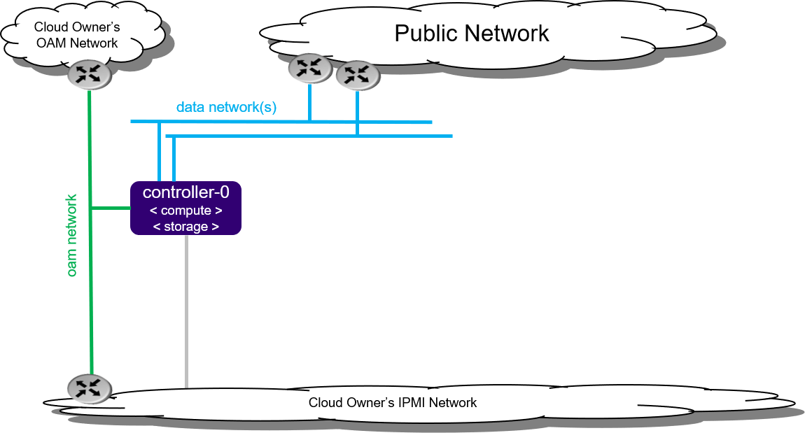

# All-in-One Simplex (AIO-SX)

## Tổng quan

All-in-One Simplex (AIO-SX) là mô hình triển khai StarlingX với **một node duy nhất** (`controller-0`), đồng thời đảm nhiệm các vai trò:

* Controller
* Compute
* Storage

Phù hợp cho môi trường lab, thử nghiệm và edge site nhỏ.

## Kiến trúc

*Hình 1. Kiến trúc All-in-One Simplex.*

## Thành phần mạng

* **OAM Network**: Mạng quản trị và truy cập hệ thống.
* **Data Network(s)**: Mạng cung cấp dịch vụ và lưu lượng ứng dụng.
* **Public Network**: Kết nối ra mạng bên ngoài.
* **IPMI Network**: Quản lý phần cứng máy chủ.

## Đặc điểm

* Chỉ sử dụng 1 node (`controller-0`).
* Không hỗ trợ High Availability (HA).
* Triển khai đơn giản, tiết kiệm tài nguyên.
