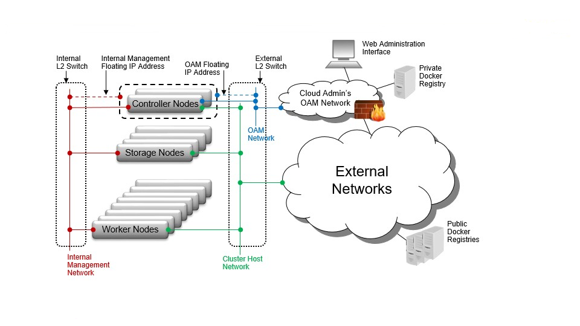

# Common Components

> Các thành phần chung xuất hiện trong hầu hết các mô hình triển khai của StarlingX.

---

## Kiến trúc tổng quan



---

# 1. Controller Node / Function

Controller là thành phần quản lý toàn bộ hệ thống StarlingX và Kubernetes.

### Chức năng

- Quản lý Kubernetes Cluster.
- Quản lý Pod, Deployment, Service, Image...
- Cung cấp các API của nền tảng.
- Điều phối toàn bộ tài nguyên.

### Storage

Ở mô hình **Standard with Controller Storage**, Controller còn chạy một cụm **Ceph nhỏ** để lưu trữ Persistent Volume (PVC).

### High Availability (HA)

Thông thường có **2 Controller** hoạt động theo:

- Active / Active
- Active / Standby

---

# 2. Worker Node / Function

Worker Node là nơi chạy các ứng dụng container.

### Nhiệm vụ

- Chạy Pod
- Chạy Deployment
- Xử lý workload của người dùng
- Không quản lý Control Plane

---

# 3. Storage Node / Function

Storage Node chỉ có trong mô hình **Standard with Dedicated Storage**.

### Chức năng

- Chạy cụm Ceph riêng.
- Lưu trữ Persistent Volume (PVC).
- Hỗ trợ:

  - Replication (2 hoặc 3 bản sao)
  - Journal Cache
  - Storage Tiering

---

# 4. All-In-One (AIO) Controller

AIO là một máy vật lý đảm nhiệm đồng thời:

- Controller
- Worker
- Storage

Thường dùng cho:

- Lab
- Demo
- Development
- Môi trường nhỏ

---

# 5. L2 Switches và L2 Networks

Một switch Layer 2 có thể phục vụ nhiều VLAN hoặc nhiều mạng Layer 2 khác nhau.

---

# 6. OAM Network (Operations, Administration and Management)

Chỉ dành cho Controller.

### Mục đích

- REST API
- Keystone
- Kubernetes API
- Horizon
- SSH
- SNMP

Thông thường sử dụng mạng **1GbE**.

---

# 7. Management Network

Áp dụng cho tất cả các node.

### Mục đích

- Quản lý nội bộ StarlingX
- Monitoring
- Điều khiển hệ thống
- Kết nối Ceph Storage

Thông thường là mạng **10GbE**.

---

# 8. Cluster Host Network

Mạng dùng cho Kubernetes.

### Chức năng

- Kubernetes Control Plane
- Giao tiếp giữa các Pod
- Mạng nội bộ của Container

Calico CNI tạo mạng overlay giữa các Pod.

Cluster Host Network có thể được cấu hình là:

- Internal
- External

---

# 8.1. Expose dịch vụ sử dụng External Cluster Host Network

Nếu Cluster Host Network là **External**:

Container có thể được publish ra ngoài bằng:

- NodePort
- Ingress Controller
- Calico BGP

### High Availability

Có thể dùng:

- External Load Balancer
- DNS nhiều bản ghi

---

# 8.2. Expose dịch vụ sử dụng Internal Cluster Host Network

Nếu Cluster Host Network là **Internal**:

Container sẽ được truy cập từ:

- OAM Interface
- Interface External bổ sung

Có thể expose bằng:

- NodePort
- Ingress

> Không hỗ trợ quảng bá dịch vụ bằng Calico BGP.

---

# 9. Additional External Networks / Data Networks

Các mạng bổ sung dành cho:

- Ứng dụng
- Ingress
- Data Traffic
- SR-IOV
- PCI Passthrough

Cho phép container kết nối trực tiếp tới NIC vật lý.

---

# 10. IPMI Network

Mạng quản lý phần cứng (Out-of-band Management).

### Chức năng

- Bật/tắt máy
- Remote Console
- Điều khiển Server

Controller phải truy cập được IPMI qua mạng Layer 3.

---

# 11. PXEBoot Network

Mạng dùng để boot server qua PXE.

Thông thường sử dụng Management Network.

Cần cấu hình riêng khi:

- Management dùng IPv6
- Management là VLAN Tagged
- BIOS không hỗ trợ PXE qua VLAN

---

# 12. Node Interfaces

StarlingX hỗ trợ nhiều kiểu cấu hình mạng.

### Untagged Single Port

Một card mạng.

```
Node
 │
NIC
 │
Switch
```

---

### Untagged Two-Port LAG

Hai NIC gộp thành Bond/LAG.

```
Node
 ├── NIC1
 └── NIC2
      │
    LAG/Bond
      │
   Switch A/B
```

Có thể kết nối tới hai switch để tăng tính HA.

---

### VLAN Interface

Một hoặc nhiều VLAN chạy trên:

- Single Port
- Bond/LAG

Ví dụ:

```
eth0
 ├── VLAN 100
 ├── VLAN 200
 └── VLAN 300
```

---

# Tóm tắt

| Thành phần | Chức năng |
|------------|-----------|
| Controller | Quản lý Kubernetes và StarlingX |
| Worker | Chạy ứng dụng |
| Storage | Ceph Storage |
| AIO | Controller + Worker + Storage |
| OAM | Quản trị hệ thống |
| Management | Quản lý nội bộ |
| Cluster Host | Mạng Kubernetes |
| External Network | Truy cập ứng dụng |
| Data Network | SR-IOV / PCI Passthrough |
| IPMI | Quản lý phần cứng |
| PXEBoot | Boot qua mạng |
| Node Interface | Cấu hình NIC và VLAN |

---

## Ghi chú

- **Controller** quản lý toàn bộ hệ thống.
- **Worker** chạy workload.
- **Storage** cung cấp Persistent Volume thông qua Ceph.
- **Calico** chịu trách nhiệm mạng Pod.
- Có thể mở dịch vụ ra ngoài bằng **NodePort**, **Ingress** hoặc **Calico BGP** (chỉ khi Cluster Host Network là External).