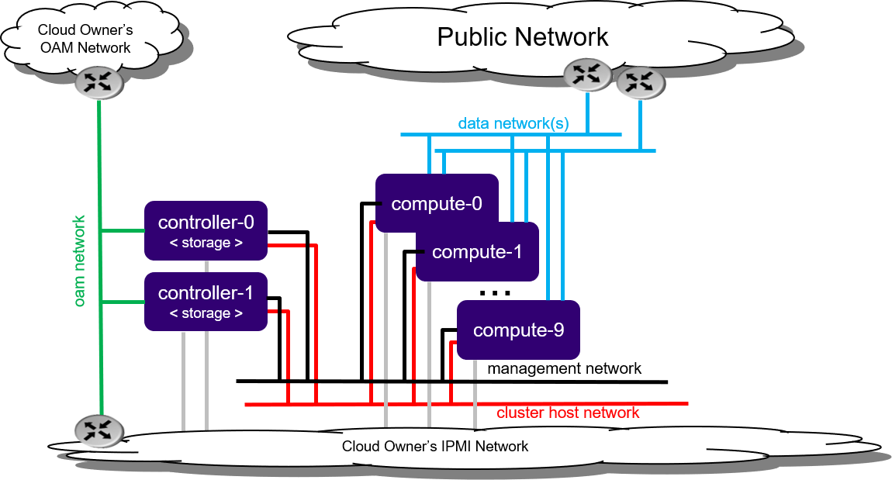

# Standard Configuration with Controller Storage

## Tổng quan

Mô hình Standard Configuration with Controller Storage sử dụng các **controller node để cung cấp storage**, thay vì triển khai các storage node riêng biệt.

StarlingX sử dụng một cụm **Ceph nhỏ** trên các controller để cung cấp backend storage cho Kubernetes PVCs.

---

## Kiến trúc

*Hình: Standard Configuration với Controller Storage.*

---

## Thành phần

* **Controller Nodes**

    * Quản lý hệ thống.
    * Cung cấp dịch vụ lưu trữ (Ceph).

* **Compute Nodes**

    * Chạy workload Kubernetes/OpenStack.

* **Networks**

    * OAM Network
    * Data Network
    * Management Network
    * Cluster Host Network
    * IPMI Network

---

## Đặc điểm

* Không cần Storage Node riêng.
* Tiết kiệm tài nguyên cho hệ thống quy mô nhỏ.
* Ceph được triển khai trực tiếp trên Controller Nodes.
* Hỗ trợ Kubernetes Persistent Volumes (PVCs).

---

## Kết luận

Mô hình này phù hợp với các triển khai nhỏ hoặc trung bình, nơi controller node vừa đảm nhận vai trò quản lý vừa cung cấp dịch vụ lưu trữ cho cụm.
