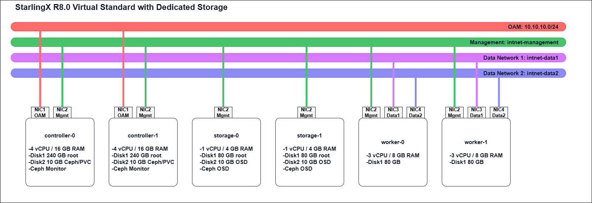

# Danh sách server

StarlingX R8.0 Virtual Standard với Dedicated Storage

## Server Inventory
| Server | Role | vCPU | RAM | Disk | Network Interfaces |
|----------|----------|------|------|------|-------------------|
| controller-0 | Controller | 4 | 16 GB | Disk1: 240 GB (Root)<br>Disk2: 10 GB (Ceph/PVC) | NIC1: OAM<br>NIC2: Management |
| controller-1 | Controller | 4 | 16 GB | Disk1: 240 GB (Root)<br>Disk2: 10 GB (Ceph/PVC) | NIC1: OAM<br>NIC2: Management |
| worker-0 | Worker | 3 | 8 GB | Disk1: 80 GB | NIC1: Unused<br>NIC2: Management<br>NIC3: Data1<br>NIC4: Data2 |
| worker-1 | Worker | 3 | 8 GB | Disk1: 80 GB | NIC1: Unused<br>NIC2: Management<br>NIC3: Data1<br>NIC4: Data2 |
| storage-0 | Storage | 1 | 4 GB | Disk1: 80 GB (Root)<br>Disk2: 10 GB (OSD) | NIC1: Unused<br>NIC2: Management |
| storage-1 | Storage | 1 | 4 GB | Disk1: 80 GB (Root)<br>Disk2: 10 GB (OSD) | NIC1: Unused<br>NIC2: Management |

---
## Network Inventory

| Network | Type | Subnet | Connected Nodes | Purpose |
|-----------|---------|---------|----------------|---------|
| OAM | Host-Only / NAT | 10.10.10.0/24 | controller-0, controller-1 | Horizon, REST API, SSH, External Access |
| Management | Internal Network | intnet-management | All Nodes | PXE Boot, Cluster Traffic, Ceph Traffic |
| Data1 | Internal Network | intnet-data1 | worker-0, worker-1 | Provider Network / VM Traffic |
| Data2 | Internal Network | intnet-data2 | worker-0, worker-1 | Additional Data Network |

---

## Storage Layout

| Node | Storage Function |
|--------|----------------|
| controller-0 | Ceph Monitor |
| controller-1 | Ceph Monitor |
| storage-0 | Ceph OSD |
| storage-1 | Ceph OSD |

### Ceph Services

- Glance Image Storage
- Cinder Volume Storage
- Nova Remote Ephemeral Storage
- Kubernetes PVC Storage
---

## Total Resource Summary

| Resource | Total |
|-----------|--------|
| Controllers | 2 |
| Workers | 2 |
| Storage Nodes | 2 |
| vCPU | 16 |
| RAM | 56 GB |
| Root Disk | 800 GB |
| OSD/PVC Disk | 40 GB |

---

## Deployment Topology

```text
OAM Network (10.10.10.0/24)
│
├── controller-0
└── controller-1

Management Network (intnet-management)
│
├── controller-0
├── controller-1
├── worker-0
├── worker-1
├── storage-0
└── storage-1

Data Network 1 (intnet-data1)
│
├── worker-0
└── worker-1

Data Network 2 (intnet-data2)
│
├── worker-0
└── worker-1

Ceph Cluster
│
├── controller-0 (Monitor)
├── controller-1 (Monitor)
├── storage-0 (OSD)
└── storage-1 (OSD)
```
# Mô hình cài đặt

# Download iso file
Link tải: https://mirror.starlingx.windriver.com/mirror/starlingx/
# Cài đặt Router VM cho môi trường lab StarlingX
Chuẩn bị VM ubuntu 22.04
## Mục đích

Router VM đóng vai trò Gateway, cho phép các node StarlingX trong mạng OAM truy cập Internet để tải gói cài đặt, container image và đồng bộ thời gian.

## Mô hình mạng

```text
Internet
    |
VirtualBox NAT
    |
Router VM
(enp0s3 - NAT)
(enp0s8 - OAM: 10.10.10.1)
    |
Host-Only Network
    |
+---------------------+
|                     |
Controller-0     Controller-1
10.10.10.2       10.10.10.3
```
## Cấu hình VirtualBox

Router VM cần 2 card mạng:

| Adapter   | Loại                 | Mục đích         |
| --------- | -------------------- | ---------------- |
| Adapter 1 | NAT                  | Kết nối Internet |
| Adapter 2 | Host-Only            | Kết nối mạng OAM |

## Bật IP Forwarding

Mở file:

```bash
sudo vi /etc/sysctl.conf
```

Bỏ comment dòng:

```bash
net.ipv4.ip_forward=1
```

Áp dụng cấu hình:

```bash
sudo sysctl -p
```

## Cấu hình IP cho mạng OAM

Gán địa chỉ IP cho card Host-Only:
Ubuntu 22.04 dùng Netplan.
Tạo file:
```bash
sudo vi /etc/netplan/50_config.yaml
```

Nội dung:
```yaml
network:
  version: 2
  renderer: networkd

  ethernets:
    enp0s8:
      addresses:
        - 10.10.10.1/24
```

Áp dụng:
```bash
sudo netplan apply
```

Kiểm tra:
```bash
ip a
```

Cần thấy:
```bash
enp0s8
  inet 10.10.10.1/24
```

## Cấu hình NAT

Cài đặt:

```bash
sudo apt update
sudo apt install -y iptables-persistent
```

Thêm rule NAT:

```bash
sudo iptables -t nat -A POSTROUTING -o enp0s3 -j MASQUERADE
sudo iptables -A FORWARD -i enp0s8 -j ACCEPT
```

Lưu cấu hình:

```bash
sudo netfilter-persistent save
```

## Cấu hình Gateway cho các node StarlingX

| Node         | IP         | Gateway    |
| ------------ | ---------- | ---------- |
| Router       | 10.10.10.1 | -          |
| Controller-0 | 10.10.10.2 | 10.10.10.1 |
| Controller-1 | 10.10.10.3 | 10.10.10.1 |

## Kiểm tra

Từ Controller:

```bash
ping 10.10.10.1
ping 8.8.8.8
ping google.com
```

Nếu các lệnh trên thành công, Router VM đã hoạt động đúng và sẵn sàng phục vụ quá trình cài đặt StarlingX.

## Tạo Máy Ảo VirtualBox cho StarlingX R8.0

### 1. Chuẩn bị mạng VirtualBox

#### OAM Network

Tạo Host-Only Network:

```text
Tools → Network → Host-only Networks → Create
```

Cấu hình:

| Tham số      | Giá trị       |
| ------------ | ------------- |
| Name         | vboxnet0      |
| IPv4 Address | 10.10.10.254  |
| Netmask      | 255.255.255.0 |
| DHCP Server  | Disable       |

#### Internal Networks

Không cần tạo trước, VirtualBox sẽ tự tạo khi khai báo tên:

```text
intnet-management
intnet-unused
intnet-data1
intnet-data2
```
---

### 2. Tạo Controller Nodes

#### controller-0

##### General

| Tham số | Giá trị              |
| ------- | -------------------- |
| Name    | controller-0         |
| Type    | Linux                |
| Version | Other Linux (64-bit) |

##### Hardware

| Tài nguyên | Giá trị |
| ---------- | ------- |
| vCPU       | 4       |
| RAM        | 16 GB   |

##### Storage

| Disk   | Dung lượng |
| ------ | ---------- |
| Disk 1 | 240 GB     |
| Disk 2 | 10 GB      |

##### Network

| Adapter   | Type              | Network           |
| --------- | ----------------- | ----------------- |
| Adapter 1 | Host-Only Adapter | vboxnet0          |
| Adapter 2 | Internal Network  | intnet-management |

##### Boot Order

```text
Floppy
Optical
Hard Disk
Network
```

##### ISO

Gắn file ISO:

```text
starlingx-intel-x86-64-cd.iso
```
---

#### controller-1

Cấu hình giống controller-0:

| Tài nguyên | Giá trị |
| ---------- | ------- |
| vCPU       | 4       |
| RAM        | 16 GB   |
| Disk 1     | 240 GB  |
| Disk 2     | 10 GB   |

##### Network

| Adapter   | Type              | Network           |
| --------- | ----------------- | ----------------- |
| Adapter 1 | Host-Only Adapter | vboxnet0          |
| Adapter 2 | Internal Network  | intnet-management |

> Lưu ý: Không gắn ISO cho controller-1.

---

### 3. Tạo Storage Nodes

#### storage-0

##### Hardware

| Tài nguyên | Giá trị |
| ---------- | ------- |
| vCPU       | 1       |
| RAM        | 4 GB    |

##### Storage

| Disk   | Dung lượng  |
| ------ | ----------- |
| Disk 1 | 80 GB       |
| Disk 2 | 10 GB (OSD) |

##### Network

| Adapter   | Type             | Network           |
| --------- | ---------------- | ----------------- |
| Adapter 1 | Internal Network | intnet-unused     |
| Adapter 2 | Internal Network | intnet-management |

---

#### storage-1

Cấu hình giống storage-0.

---

### 4. Tạo Worker Nodes

#### worker-0

##### Hardware

| Tài nguyên | Giá trị |
| ---------- | ------- |
| vCPU       | 3       |
| RAM        | 8 GB    |

##### Storage

| Disk   | Dung lượng |
| ------ | ---------- |
| Disk 1 | 80 GB      |

##### Network

| Adapter   | Type             | Network           |
| --------- | ---------------- | ----------------- |
| Adapter 1 | Internal Network | intnet-unused     |
| Adapter 2 | Internal Network | intnet-management |
| Adapter 3 | Internal Network | intnet-data1      |
| Adapter 4 | Internal Network | intnet-data2      |

---

#### worker-1

Cấu hình giống worker-0.

---

### 5. Thiết lập PXE Boot

Thực hiện trên máy Host:

```bash
VBoxManage modifyvm controller-0 --nicbootprio2 1
VBoxManage modifyvm controller-1 --nicbootprio2 1

VBoxManage modifyvm storage-0 --nicbootprio2 1
VBoxManage modifyvm storage-1 --nicbootprio2 1

VBoxManage modifyvm worker-0 --nicbootprio2 1
VBoxManage modifyvm worker-1 --nicbootprio2 1
```

---

### 6. Kiểm tra Topology

```text
vboxnet0 (OAM)
│
├── controller-0
└── controller-1

intnet-management
│
├── controller-0
├── controller-1
├── storage-0
├── storage-1
├── worker-0
└── worker-1

intnet-data1
│
├── worker-0
└── worker-1

intnet-data2
│
├── worker-0
└── worker-1
```

---

### 7. Bắt đầu cài đặt

1. Khởi động `controller-0`.
2. Chọn:

```text
Graphics Controller Node Install
```

3. Sau khi cài xong và bootstrap thành công:

      * Khởi động controller-1
      * Khởi động storage-0, storage-1
      * Khởi động worker-0, worker-1

4. Nhấn:

```text
F12 → LAN Boot
```

để các node PXE boot từ controller-0.


