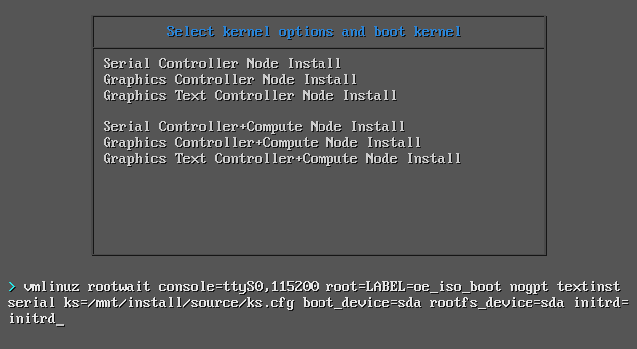
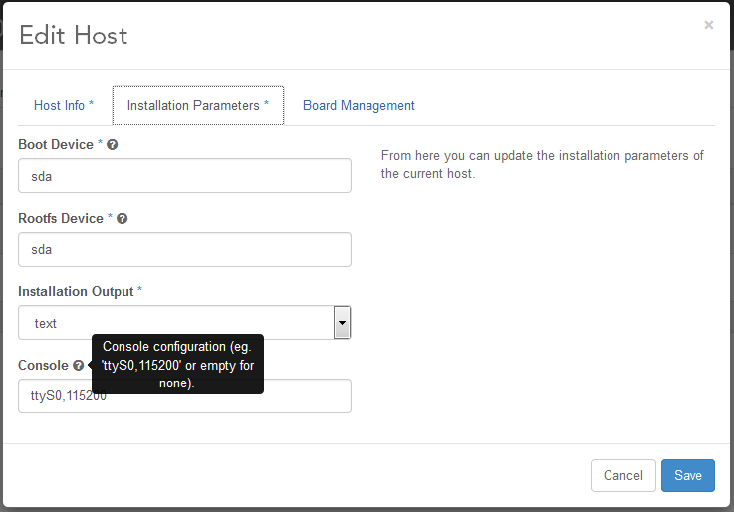

# Cài đặt StarlingX trên VirtualBox

Phần này hướng dẫn triển khai StarlingX trên các máy ảo **VirtualBox**, thay thế cho môi trường mặc định sử dụng **libvirt/KVM**.

## Mục đích

Triển khai môi trường StarlingX Lab trên VirtualBox để học tập, thử nghiệm và đánh giá tính năng.

## Nội dung triển khai

* Chuẩn bị môi trường VirtualBox.
* Tạo các VM Controller, Worker và Storage.
* Khởi động Controller Node để bắt đầu cài đặt.
* Tùy chỉnh các tham số cài đặt.

---

## Chuẩn bị

Trước khi triển khai cần chuẩn bị:

### Máy chủ cài đặt

* Windows hoặc Linux.
* Đủ tài nguyên CPU, RAM và Disk để chạy nhiều VM.

### VirtualBox

Cài đặt VirtualBox trên máy chủ.

### VirtualBox Extension Pack

Bắt buộc cài đặt VirtualBox Extension Pack để hỗ trợ:

* PXE Boot
* Intel Network Adapter

Điều này cho phép Worker và Storage Node có thể boot qua mạng từ Controller Node.
### Lưu ý
- StarlingX cung cấp bộ script tạo VM trong repository [tools](https://opendev.org/starlingx/tools).
- Các script này có thể chưa được cập nhật theo khuyến nghị mới nhất của StarlingX.
- Nên kiểm tra tài liệu phiên bản hiện tại trước khi sử dụng.

## Tạo VM Controller, Worker và Storage Hosts

Đối với mỗi node StarlingX, cần tạo một máy ảo (VM) trong VirtualBox với cấu hình phù hợp theo vai trò của node.

### OS Type và Memory Settings

Cấu hình hệ điều hành cho tất cả các VM:

| Tham số | Giá trị              |
| ------- | -------------------- |
| Type    | Linux                |
| Version | Other Linux (64-bit) |

Phân bổ RAM

| Node Type       | RAM              |
| --------------- | ---------------- |
| Controller Node | 16384 MB (16 GB) |
| Worker Node     | 8192 MB (8 GB)   |
| Storage Node    | 4096 MB (4 GB)   |
| All-in-One Node | 20480 MB (20 GB) |

### Mô hình ví dụ

```text
Controller-0 : 16 GB RAM
Controller-1 : 16 GB RAM

Worker-0     : 8 GB RAM
Worker-1     : 8 GB RAM

Storage-0    : 4 GB RAM
Storage-1    : 4 GB RAM
```

### Disk Settings

Sử dụng cấu hình mặc định của VirtualBox:

* Disk Controller: Mặc định (IDE)
* Disk Format: VDI

#### Controller Nodes

Mỗi Controller cần tối thiểu **2 ổ đĩa**:

| Disk   | Dung lượng |
| ------ | ---------- |
| Disk 1 | 240 GB     |
| Disk 2 | 10 GB      |

> Nếu sử dụng Analytics, nên tăng Disk 2 lên **30 GB**.

#### Worker Nodes

| Disk      | Dung lượng |
| --------- | ---------- |
| Root Disk | 80 GB      |

> Với mô hình AIO, khuyến nghị sử dụng **100 GB**.

Lưu ý:

* Khi cấu hình Local Storage, hệ thống cung cấp khoảng **12 GB** cho VM Instances.
* Có thể bổ sung thêm ổ đĩa để mở rộng Local Storage nếu cần.

#### Storage Nodes

Mỗi Storage Node cần tối thiểu **2 ổ đĩa**:

| Disk      | Dung lượng |
| --------- | ---------- |
| Root Disk | 80 GB      |
| OSD Disk  | ≥ 10 GB    |

Lưu ý:

* Mỗi OSD yêu cầu một ổ đĩa riêng.
* Dung lượng OSD phụ thuộc vào nhu cầu lưu trữ và số lượng VM dự kiến triển khai.

#### Installation ISO

Gắn file ISO StarlingX vào ổ CD/DVD của VM:

1. Chọn **Storage** trong cấu hình VM.
2. Chọn **Empty CD-ROM**.
3. Nhấn biểu tượng CD/DVD.
4. Chọn file ISO StarlingX.

> Chỉ gắn ISO cho **controller-0**.

Các node còn lại:

* controller-1
* worker nodes
* storage nodes

sẽ thực hiện **PXE Network Boot** từ controller-0.

### System Settings

Cấu hình các thông số hệ thống trong VirtualBox cho từng VM.

#### Motherboard Settings

Vào:

```text
System → Motherboard
```

Cấu hình Boot Order:

1. Floppy
2. CD/DVD
3. Hard Disk
4. Network

> Bắt buộc bật tùy chọn **Network Boot (PXE)** để các node có thể khởi động qua mạng.

---

#### Processor Settings

Vào:

```text
System → Processor
```

Cấu hình CPU theo vai trò của node:

| Node Type       | vCPU |
| --------------- | ---- |
| Controller Node | 4    |
| Worker Node     | 3    |
| Storage Node    | 1    |

---

#### Lưu ý cho Worker Node

Cấu hình mặc định chỉ đủ tài nguyên để chạy một VM Instance.

Nếu muốn chạy nhiều VM hơn:

* Tăng số lượng vCPU cho Worker Node.

Nếu Worker được cấp phát **hơn 4 vCPU**, cần giới hạn số CPU dành cho **vSwitch** trước khi unlock node:

```bash
system host-cpu-modify worker-0 -f vswitch -p0 1
```

Nếu không thực hiện bước này:

* vSwitch có thể khởi động thất bại.
* Dịch vụ quan trọng bị lỗi.
* Node sẽ liên tục reboot (reboot loop).

### Network Settings

Cấu hình mạng cho các VM trong VirtualBox.

#### OAM Network

OAM Network có hai lựa chọn:

##### Host-Only Network (Khuyến nghị)

* Tạo một Host-Only Adapter trong VirtualBox.
* Router VM sẽ chuyển tiếp lưu lượng từ Controller ra mạng ngoài.
* Cấu hình mặc định:

| Tham số      | Giá trị       |
| ------------ | ------------- |
| IPv4 Address | 10.10.10.254  |
| Netmask      | 255.255.255.0 |
| DHCP Server  | Disabled      |

##### NAT Network

* Cho phép Controller VM truy cập mạng ngoài trực tiếp thông qua NAT của VirtualBox.

---

#### Controller Nodes

| Adapter   | Cấu hình                                 |
| --------- | ---------------------------------------- |
| Adapter 1 | Host-Only Adapter hoặc NAT Network (OAM) |
| Adapter 2 | Internal Network: `intnet-management`    |

Lưu ý:

* Adapter Type: Intel PRO/1000MT Desktop
* Promiscuous Mode:

  * Adapter 1: Deny
  * Adapter 2: Allow All

---

#### Worker Nodes

| Adapter   | Cấu hình                    |
| --------- | --------------------------- |
| Adapter 1 | `intnet-unused`             |
| Adapter 2 | `intnet-management`         |
| Adapter 3 | `intnet-data1` (virtio-net) |
| Adapter 4 | `intnet-data2` (virtio-net) |

Lưu ý:

* Tất cả adapter sử dụng Promiscuous Mode = Allow All.
* Có thể bổ sung NIC để mô phỏng LAG.

Ví dụ thêm NIC bằng VBoxManage:

```bash
VBoxManage modifyvm worker-0 --nic5 intnet --nictype5 virtio --intnet5 intnet-data1 --nicpromisc5 allow-all

VBoxManage modifyvm worker-0 --nic6 intnet --nictype6 virtio --intnet6 intnet-data2 --nicpromisc6 allow-all

VBoxManage modifyvm worker-0 --nic7 intnet --nictype7 82540EM --intnet7 intnet-infra --nicpromisc7 allow-all
```

---

#### Storage Nodes

| Adapter   | Cấu hình            |
| --------- | ------------------- |
| Adapter 1 | `intnet-unused`     |
| Adapter 2 | `intnet-management` |

Lưu ý:

* Adapter Type: Intel PRO/1000MT Desktop
* Promiscuous Mode: Allow All

---

#### PXE Boot Priority

Tất cả VM (Controller, Worker, Storage) phải PXE Boot từ Interface 2 (`eth1`).

Cấu hình:

```bash
VBoxManage modifyvm <vm-name> --nicbootprio2 1
```

Ví dụ:

```bash
VBoxManage modifyvm controller-0 --nicbootprio2 1
```

---

#### PXE Boot Debug

Nếu PXE Boot không hoạt động:

1. Khởi động VM.
2. Nhấn `F12` để vào Boot Menu.
3. Chọn `L` (LAN Boot).
4. Nhấn `Ctrl + B` để vào iPXE CLI.

Chạy lệnh:

```text
autoboot
```

Lệnh này sẽ kiểm tra từng interface và thử thực hiện Network Boot.
### Serial Port Settings

Nếu muốn sử dụng **Serial Console**, cần bật Serial Port trên VM trước khi cài đặt StarlingX.

#### Windows

Cấu hình:

* Enable Serial Port
* Port Mode: **Host Pipe**
* Chọn **Create Pipe**
* Port/File Path:

```text
\\.\pipe\controller-0
```

hoặc

```text
\\.\pipe\worker-1
```

Sau đó có thể sử dụng **PuTTY** để kết nối vào Serial Console.

Tốc độ khuyến nghị:

* 9600
* 38400

---

#### Linux

Cấu hình:

* Enable Serial Port
* Port Mode: **Host Pipe**
* Chọn **Create Pipe**
* Port/File Path:

```text
/tmp/controller_serial
```

Kết nối Serial Console bằng:

```bash
socat UNIX-CONNECT:/tmp/controller_serial stdio,raw,echo=0,icanon=0
```
---

### Tóm tắt

| Thành phần     | Cấu hình  |
| -------------- | --------- |
| Serial Console | Host Pipe |
| Windows Client | PuTTY     |
| Linux Client   | socat     |
| Dell R720      | EnableHVP |


## Khởi tạo Controller VM và boot hệ thống

Khởi động **controller-0** và chọn chế độ cài đặt phù hợp.

### Console Options

#### Serial Console

Chọn:

```text
Serial Controller Node Install
```

Sau đó kết nối qua Serial Console đã cấu hình trước đó.

#### Graphical Console

Chọn:

```text
Graphics Controller Node Install
```

và tiếp tục thao tác trên giao diện VirtualBox Console.

---

### Boot các node còn lại

Đối với:

* AIO-DX
* Standard Configuration

Các node còn lại:

* controller-1
* worker
* storage

sẽ không boot từ ISO mà boot qua mạng từ **controller-0**.

Thao tác:

1. Khởi động VM.
2. Nhấn `F12`.
3. Chọn `LAN Boot`.

---

### Cấu hình các tham số cài đặt

StarlingX cho phép tùy chỉnh một số tham số cài đặt.

| Tham số        | Mô tả                                |
| -------------- | ------------------------------------ |
| boot_device    | Thiết bị chứa phân vùng boot         |
| rootfs_device  | Thiết bị chứa root filesystem        |
| install_output | Chế độ cài đặt (text hoặc graphical) |
| console        | Cấu hình serial console              |

#### Giá trị mặc định

| Tham số        | Mặc định     |
| -------------- | ------------ |
| boot_device    | sda          |
| rootfs_device  | sda          |
| install_output | text         |
| console        | ttyS0,115200 |

---

#### Cài đặt tùy chỉnh Controller-0 từ ISO


Để thay đổi tham số cài đặt:

1. Tại màn hình boot menu.
2. Chọn mục cài đặt mong muốn.
3. Nhấn `Tab`.
4. Chỉnh sửa các tham số boot.

Ví dụ:

```text
rootfs_device=sdb
```

---

#### Cài đặt Nodes từ Active Controller

Sau khi controller-0 hoạt động, có thể thay đổi tham số cài đặt của các node bằng CLI.

##### Cài đặt giao diện đồ họa

```bash
system host-update 2 personality=controller install_output=graphical console=
```

##### Cài đặt dạng text

```bash
system host-update 2 personality=controller install_output=text console=
```

##### Cài đặt lên ổ đĩa thứ hai

```bash
system host-update 3 personality=compute hostname=compute-0 rootfs_device=sdb
```

Các tham số này cũng có thể được cấu hình từ giao diện GUI thông qua chức năng **Edit Host**.


### Lưu ý

* Đảm bảo đã cấu hình PXE Boot Priority cho tất cả VM.
* Controller-0 luôn được cài từ ISO hoặc USB.
* Các node còn lại được cài đặt thông qua PXE Boot từ controller-0.


