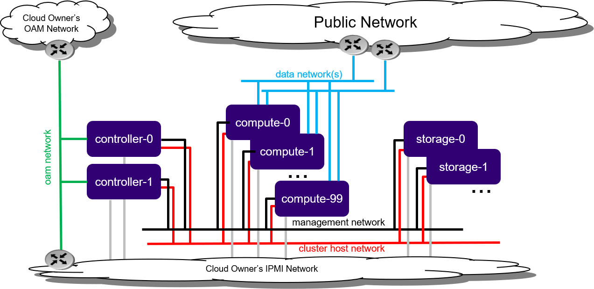

# Cài đặt mô hình Standard với Dedicated Storage trong môi trường máy ảo

## Overview

**Standard với Dedicated Storage** là mô hình triển khai StarlingX với các node được tách biệt theo chức năng:

* **Controller Nodes**: Quản lý và điều phối hệ thống.
* **Worker Nodes**: Chạy ứng dụng và workload.
* **Storage Nodes**: Cung cấp lưu trữ Ceph.

### Kiến trúc triển khai

*Hình: Standard with Dedicated Storage deployment configuration*

### Đặc điểm chính

* Hỗ trợ tối đa **200 Worker Nodes**.
* Cụm **2 Controller Nodes** hoạt động HA (High Availability).
* Hỗ trợ dịch vụ HA ở chế độ:
    * Active/Active
    * Active/Standby
* Backend lưu trữ sử dụng **Ceph Cluster**.
* Hỗ trợ:
    * 2 đến 9 Storage Nodes.
    * Replication Factor 2 hoặc 3.

* Tối đa:
    * 4 nhóm × 2 Storage Nodes, hoặc
    * 3 nhóm × 3 Storage Nodes.

### Lưu ý về Proxy

Nếu hệ thống nằm sau Firewall hoặc Proxy doanh nghiệp, cần cấu hình Proxy trước khi cài đặt.

### Lưu ý về IPv6

Mặc định StarlingX sử dụng **IPv4**.

Nếu triển khai **IPv6**:

* Toàn bộ hạ tầng phải sử dụng IPv6.
* Riêng mạng **PXE Boot** vẫn phải sử dụng IPv4.
* Một số dịch vụ bên ngoài (Docker Registry...) có thể chỉ hỗ trợ IPv4.
* Có thể cần triển khai **NAT64/DNS64 Gateway** để chuyển đổi IPv4 ↔ IPv6.

