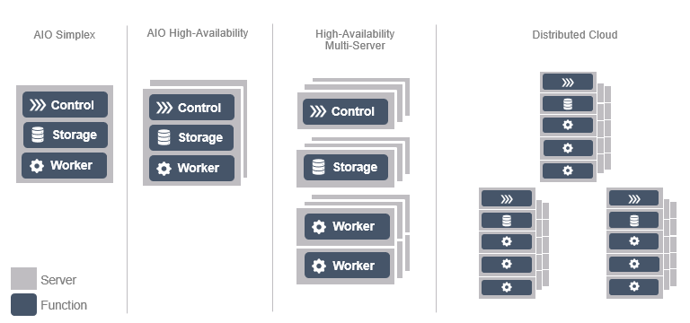

# Các mô hình triển khai

## Mục tiêu của các mô hình triển khai

StarlingX được thiết kế cho nhiều quy mô Edge Cloud khác nhau, từ một địa điểm nhỏ chỉ có một máy chủ cho tới hệ thống phân tán gồm nhiều cụm Edge được quản lý tập trung.

Để đáp ứng các nhu cầu đó, StarlingX cung cấp nhiều mô hình triển khai (Deployment Configurations) đã được thiết kế sẵn.

Các mô hình này cho phép cân bằng giữa:

* Chi phí triển khai
* Độ sẵn sàng cao (High Availability)
* Khả năng mở rộng
* Nhu cầu lưu trữ
* Số lượng workload

StarlingX có thể triển khai từ:

* 1 máy chủ duy nhất
* 2 máy chủ HA
* Hàng trăm node Worker
* Nhiều Edge Site phân tán trên phạm vi địa lý rộng

---




---
# Các mô hình triển khai của StarlingX

## Tổng quan

StarlingX hỗ trợ bốn nhóm kiến trúc triển khai chính:

1. All-in-One Simplex (AIO-SX)
2. All-in-One Duplex (AIO-DX)
3. Standard Configuration
4. Distributed Cloud

---

# 1. All-in-One Simplex (AIO-SX)

## Kiến trúc

Trong mô hình này chỉ có **một máy chủ duy nhất**.

Máy chủ đó đồng thời đảm nhận:

* Controller
* Worker
* Storage

```text
+----------------------+
|      AIO-SX Node     |
|----------------------|
| Controller Function  |
| Worker Function      |
| Storage Function     |
+----------------------+
```

## Đặc điểm

### Ưu điểm

* Cấu hình đơn giản nhất
* Chi phí thấp
* Dễ triển khai trong môi trường lab
* Phù hợp học tập và thử nghiệm

### Nhược điểm

* Không có High Availability
* Single Point of Failure
* Không phù hợp môi trường Production

## Trường hợp sử dụng

* Lab
* PoC (Proof of Concept)
* Demo
* Development Environment


# 2. All-in-One Duplex (AIO-DX)

## Kiến trúc

Mô hình gồm hai node vật lý.

Mỗi node chạy:

* Controller
* Worker
* Storage

```text
+------------------+      +------------------+
|   Controller-0   |      |   Controller-1   |
|     Worker       |      |     Worker       |
|     Storage      |      |     Storage      |
+------------------+      +------------------+
```

## Đặc điểm

### Ưu điểm

* Hỗ trợ High Availability
* Không có điểm lỗi đơn lẻ
* Tiết kiệm chi phí hơn Standard

### Nhược điểm

* Giới hạn khả năng mở rộng
* Tài nguyên Controller và Workload dùng chung

## Trường hợp sử dụng

* Edge Site
* Telecom Edge
* MEC Site
* Small Production Deployment

---

# 3. Standard Configuration

## Kiến trúc

Đây là mô hình triển khai đầy đủ nhất.

Node được tách thành các vai trò riêng biệt:

* Controller Nodes
* Worker Nodes
* Storage Nodes (tuỳ chọn)

```text
+----------------------+
| Controller-0         |
+----------------------+

+----------------------+
| Controller-1         |
+----------------------+

+----------------------+
| Worker Pool          |
| Worker-1             |
| Worker-2             |
| Worker-3             |
+----------------------+
```

## Đặc điểm

### Ưu điểm

* High Availability
* Khả năng mở rộng cao
* Tách biệt tài nguyên quản lý và workload
* Phù hợp Production

### Quy mô

Thông thường:

* 2 Controller Nodes
* Tối đa khoảng 100 Worker Nodes trong R6.0
* Có thể mở rộng thêm Storage Cluster

Nguồn: StarlingX Deployment Configurations Overview.

---

# Standard with Controller Storage

Trong mô hình này:

* Controller đồng thời cung cấp Ceph Storage

```text
Controller + Storage
Controller + Storage
Worker
Worker
Worker
```

### Ưu điểm

* Tiết kiệm phần cứng
* Triển khai đơn giản

### Nhược điểm

* Storage và Control Plane dùng chung tài nguyên

---

# Standard with Dedicated Storage

Trong mô hình này:

```text
Controller
Controller

Storage
Storage
Storage

Worker
Worker
Worker
```

Storage được tách thành các node riêng.

## Ưu điểm

* Hiệu năng cao
* Khả năng mở rộng tốt
* Hỗ trợ dung lượng lớn

## Nhược điểm

* Chi phí cao hơn

---

# 4. Distributed Cloud

## Mục tiêu

Cho phép quản lý tập trung nhiều Edge Cloud.

Ví dụ:

```text
                System Controller
                       |
      ------------------------------------
      |                |                |
  Subcloud-1      Subcloud-2      Subcloud-3
```

## Thành phần

### System Controller

Là trung tâm quản lý:

* Inventory
* Alarm
* Patch
* Upgrade
* Monitoring

### Subcloud

Là các cụm StarlingX độc lập ở các địa điểm khác nhau.

Mỗi Subcloud có thể là:

* AIO-SX
* AIO-DX
* Standard

---

## Lợi ích

### Quản lý tập trung

Một giao diện duy nhất quản lý toàn bộ hệ thống.

### Edge Scalability

Có thể triển khai hàng trăm Edge Site.

### Lifecycle Management

Thực hiện:

* Patch
* Upgrade
* Monitoring

từ System Controller.

---

# So sánh các mô hình triển khai

| Tiêu chí          | AIO-SX    | AIO-DX     | Standard   | Distributed Cloud |
| ----------------- | --------- | ---------- | ---------- | ----------------- |
| Số node tối thiểu | 1         | 2          | 2+         | Nhiều cloud       |
| High Availability | ❌         | ✅          | ✅          | ✅                 |
| Production        | ❌         | ✅          | ✅          | ✅                 |
| Khả năng mở rộng  | Thấp      | Trung bình | Cao        | Rất cao           |
| Chi phí           | Thấp nhất | Trung bình | Cao        | Cao nhất          |
| Mục tiêu          | Lab       | Edge nhỏ   | Production | Multi-Site        |

---

# Kết luận

StarlingX cung cấp nhiều mô hình triển khai khác nhau nhằm đáp ứng các yêu cầu từ phòng lab nhỏ đến hệ thống Edge Cloud quy mô lớn. Trong thực tế:

* AIO-SX phù hợp cho học tập và thử nghiệm.
* AIO-DX phù hợp cho các Edge Site nhỏ cần HA.
* Standard Configuration phù hợp môi trường Production.
* Distributed Cloud phù hợp triển khai và quản lý hàng loạt Edge Site trên diện rộng.
