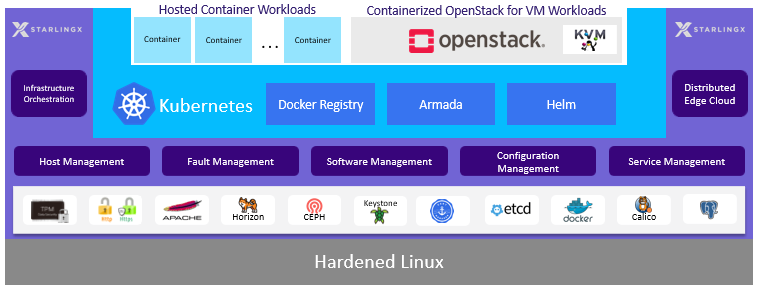

# Các khối chức năng chính

## Tổng quan

StarlingX là một nền tảng **Edge Cloud Infrastructure** được thiết kế để triển khai và vận hành các ứng dụng yêu cầu:

* Độ trễ cực thấp (Ultra-low Latency)
* Độ sẵn sàng cao (High Availability)
* Quản lý tập trung tại Edge
* Hỗ trợ cả Container và Virtual Machine
* Vận hành trong môi trường viễn thông, công nghiệp và IoT

Khác với việc phải tự tích hợp nhiều thành phần riêng lẻ như Linux, Kubernetes, OpenStack, Ceph và các công cụ quản lý hệ thống, StarlingX cung cấp một **stack hoàn chỉnh đã được tích hợp và kiểm thử sẵn**. Điều này giúp giảm đáng kể độ phức tạp trong triển khai và vận hành Edge Cloud.

---

## Kiến trúc tổng thể




---

## Các thành phần chính

StarlingX được xây dựng từ nhiều dự án mã nguồn mở nổi tiếng và được tích hợp thành một nền tảng thống nhất.

```text
+------------------------------------------------------+
|                   User Workloads                     |
|        Containers (Kubernetes) / VMs (OpenStack)     |
+------------------------------------------------------+
|             Kubernetes / OpenStack Layer             |
+------------------------------------------------------+
|            StarlingX Platform Services               |
+------------------------------------------------------+
|          Linux Operating System & Hardware           |
+------------------------------------------------------+
```

---

# Hardened Linux

Lớp nền tảng thấp nhất của StarlingX là hệ điều hành Linux được tối ưu hóa cho môi trường Edge.

Các thành phần chính bao gồm:

* Linux Kernel 5.10 dựa trên Yocto Project
* Debian Bullseye (11.x)
* OSTree
* Installer được tối ưu cho Edge

## Linux Kernel 5.10

StarlingX R6.0 chuyển sang sử dụng Linux Kernel 5.10 LTS dựa trên Yocto Project thay vì kernel truyền thống của CentOS. Điều này mang lại:

* Theo sát các bản vá ổn định của Linux
* Hỗ trợ PREEMPT_RT cho Real-Time Workload
* Quản lý CVE hiệu quả hơn
* Dễ dàng tích hợp các tối ưu cho Edge Computing

## Debian

Từ phiên bản R6.0, StarlingX bắt đầu quá trình chuyển đổi sang Debian.

Lợi ích:

* Cộng đồng lớn
* Chu kỳ hỗ trợ dài
* Hệ sinh thái package phong phú
* Dễ dàng bảo trì lâu dài

## OSTree

OSTree cung cấp:

* Atomic Upgrade
* Rollback nhanh chóng
* Quản lý phiên bản hệ điều hành
* Giảm rủi ro trong quá trình nâng cấp

---

# Open Source Infrastructure Services

StarlingX tích hợp sẵn nhiều dịch vụ nền tảng phổ biến:

| Thành phần | Chức năng                   |
| ---------- | --------------------------- |
| Apache     | Web Service                 |
| PostgreSQL | Database                    |
| Etcd       | Distributed Key-Value Store |
| Ceph       | Distributed Storage         |
| IPMI       | Quản lý phần cứng           |
| Keystone   | Identity Service            |
| Barbican   | Secret Management           |
|      ...   |               ...           |

Các dịch vụ này được triển khai và quản lý như một phần của nền tảng StarlingX.

---

# StarlingX Platform Services

Đây là lớp cốt lõi của StarlingX.

## Infrastructure Management

StarlingX quản lý:

* Cài đặt hệ thống
* Quản lý phần cứng
* Quản lý cấu hình
* Kiểm kê tài nguyên

## Fault Management

Theo dõi:

* Hardware Fault
* Software Fault
* Alarm
* Event
* Log

Hệ thống có khả năng tự động phát hiện và phục hồi dịch vụ khi xảy ra lỗi.

## Lifecycle Management

Hỗ trợ:

* Patch
* Upgrade
* Rollback
* Configuration Management

Toàn bộ stack có thể được nâng cấp đồng bộ từ kernel tới Kubernetes.

## High Availability

StarlingX được thiết kế cho môi trường yêu cầu uptime cao:

* Controller HA
* Service Monitoring
* Automatic Recovery
* Distributed Control Plane

---

# Kubernetes Layer

Kubernetes là nền tảng điều phối container chính trong StarlingX.

Các thành phần chính:

| Thành phần        | Chức năng                   |
| ----------------- | --------------------------- |
| Kubernetes        | Container Orchestration     |
| Container Runtime | Chạy container              |
| Calico            | Networking (CNI)                 |
| Multus            | Multiple Network Interface  |
| SR-IOV            | High Performance Networking |
| Helm              | Package Manager             |
| FluxCD            | GitOps                      |
| Ceph              | Persistent Storage          |

## Networking Acceleration

StarlingX hỗ trợ:

* SR-IOV
* DPDK
* Multus CNI

Những công nghệ này rất quan trọng trong:

* 5G Core
* vRAN
* MEC
* Industrial IoT

---

# OpenStack Layer

Ngoài Kubernetes, StarlingX còn hỗ trợ Virtual Machine thông qua OpenStack.

Các dịch vụ chính:

| Service  | Chức năng     |
| -------- | ------------- |
| Keystone | Identity      |
| Nova     | Compute       |
| Neutron  | Network       |
| Glance   | Image         |
| Cinder   | Block Storage |
| Horizon  | Dashboard     |
| Heat     | Orchestration |

## Mối quan hệ giữa Kubernetes và OpenStack

StarlingX hỗ trợ đồng thời:

* Container Workloads trên Kubernetes
* VM Workloads trên OpenStack

Điều này cho phép doanh nghiệp:

* Chạy ứng dụng Cloud-Native
* Chạy ứng dụng Legacy VM
* Chuyển đổi dần từ VM sang Container

---

# Giá trị nổi bật của StarlingX

## All-in-One Solution

Một gói phần mềm duy nhất bao gồm:

* Linux
* Storage
* Networking
* Kubernetes
* OpenStack
* Monitoring
* Fault Management

## Edge Optimized

Được thiết kế cho:

* Telecom
* 5G
* Industrial IoT
* MEC
* Smart City

## High Availability

Hỗ trợ:

* HA Controller
* Fault Recovery
* Service Monitoring
* Distributed Cloud

## Lifecycle Management

Cho phép:

* Patch
* Upgrade
* Rollback

trên toàn bộ hệ thống một cách nhất quán.

---

# Kết luận

StarlingX không chỉ đơn thuần là Kubernetes hay OpenStack. Đây là một nền tảng Edge Cloud hoàn chỉnh tích hợp:

* Hardened Linux
* Platform Management
* Fault Management
* Kubernetes
* OpenStack
* Ceph Storage
* Distributed Cloud

Nhờ khả năng quản lý vòng đời hệ thống, độ sẵn sàng cao và tối ưu cho môi trường Edge, StarlingX đặc biệt phù hợp với các hệ thống viễn thông 5G, MEC và Industrial IoT.
