# Tổng hợp về Dự án StarlingX


---

## Các điểm chính của Dự án
* **Mã nguồn ban đầu:** Dự án bắt nguồn từ mã nguồn của sản phẩm **Titanium Cloud** từ Wind River, public năm 2018.
* **Dự án của Open Infrastructure Foundation:** StarlingX là một dự án trọng điểm (Top-level project) được bảo trợ và phát triển bởi tổ chức Open Infrastructure Foundation (OIF).
* **Kiến trúc phần mềm quản lý toàn diện:** Đây là một tập hợp các tầng phần mềm (software stack) cung cấp giải pháp quản lý hạ tầng và dịch vụ trọng yếu cho cả các ứng dụng đám mây tập trung (centralized) lẫn đám mây phân tán (distributed).
* **Chu kỳ phát hành thường xuyên:** Dự án liên tục cập nhật và ra mắt các phiên bản mới (Frequent releases) để cải tiến tính năng và hiệu suất.
* **Cộng đồng đang trên đà phát triển:** Dự án ghi nhận sự tăng trưởng mạnh mẽ về số lượng thành viên tham gia.

---

## Liên kết

* **Mã nguồn dự án:** [OpenDev StarlingX](https://opendev.org/starlingx)
* **Kho lưu trữ các phiên bản phát hành:** [Wind River StarlingX Mirror](https://mirror.starlingx.windriver.com/mirror/starlingx/release/)

## Use Case Frontiers

### Kết hợp các công nghệ Cloud đã được kiểm chứng

- Điều phối tài nguyên trên toàn hệ thống.
- Triển khai và quản lý các đám mây cục bộ và từ xa, đồng thời chia sẻ cấu hình.
- Đơn giản hóa việc triển khai tại các khu vực phân tán về mặt địa lý.
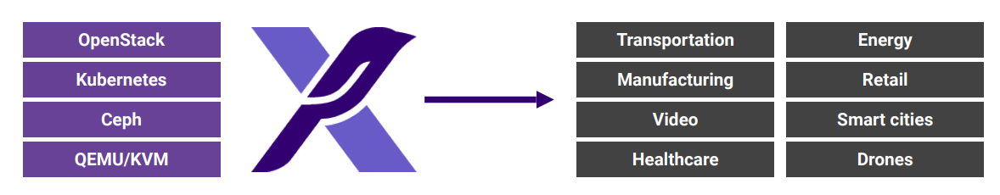

## High-level Use Cases

| Telecommunications | Enterprise / Datacenter |
|-------------------|-------------------------|
| Platform Reliability | Platform Manageability |
| Predictable & Static Workloads | Workload Variability |
| Realtime Performance | Cluster Scale (100s workers) |
| Small Footprint (Single Node) | Autoscaling |
| Single Tenant | Multi-tenancy |
| White-Glove Support | Self-Service |

## Real-life Scenarios

### Telecommunications
- 5G vRAN / Open RAN
- Core Network Functions
- Multi-access Edge Computing (MEC)
- Network IT (OSS/BSS)
- Sovereign Cloud

### Industrial & Manufacturing
- Smart Factory / IT-OT Convergence
- Real-time Industrial Automation and Robotics
- Predictive Maintenance and Edge Analytics
- Digital Twins and Simulation
- Distributed Edge for Multi-site Operations

### Automotive
- ADAS and Autonomous Driving Platform
- Vehicle-to-Everything (V2X) Communication
- Software-defined Vehicle Infrastructure
- Secure OTA Updates
- In-vehicle and AI/ML Edge Workloads

### Aerospace & Defense
- Command, Control, Communications Systems
- Avionics and Flight Systems
- Secure and Sovereign Cloud Deployments
- Simulation, Training and Digital Twins
- Multi-domain Edge Operations

### Healthcare
- Medical Imaging, Diagnostics & Real-time Monitoring
- Surgical Robotics & Telemedicine
- Secure, Compliant Data Infrastructure
- AI/ML for Diagnostics & Predictive Care
- Smart Hospitals & IoT Device Integration

### Energy & Utilities
- Smart Grids and Grid Modernization
- Oil & Gas Operations
- Renewable Energy Plants
- Critical Infrastructure Security & Compliance
- Distributed Edge Operations Across Substations & Plants

### Transportation & Smart Cities
- Rail, Port and Airport Operations
- Real-time Traffic Management
- Passenger Services & Smart Mobility
- IoT & AI Workloads at the Edge
- Secure, Distributed Critical Infrastructure

# StarlingX Cloud in One Datacenter
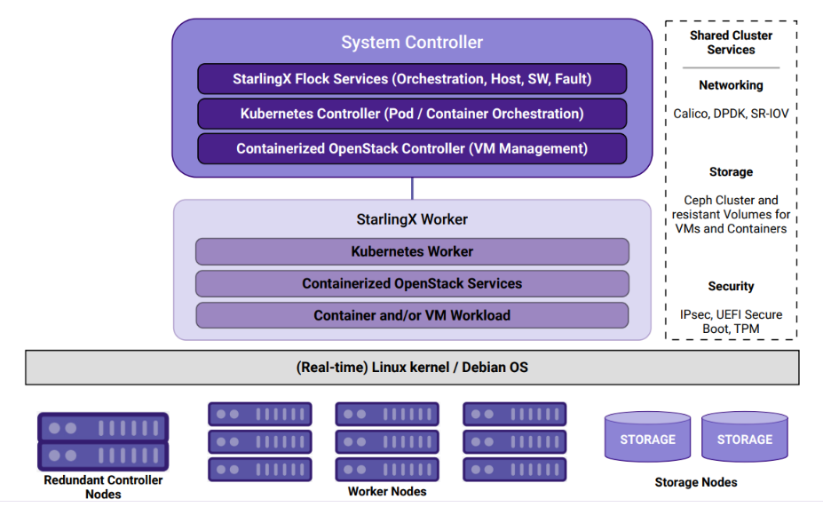

## Đặc điểm chính

- System Controller cung cấp khả năng quản lý tập trung cho toàn bộ datacenter.
- Hỗ trợ cấu hình High Availability (HA) để đảm bảo hoạt động liên tục.
- Sử dụng container cho cả workload ứng dụng và các dịch vụ hạ tầng.

## Kiến trúc

### System Controller

- StarlingX Flock Services
  - Điều phối hệ thống (Orchestration)
  - Quản lý máy chủ (Host Management)
  - Quản lý phần mềm (Software Management)
  - Quản lý sự cố (Fault Management)

- Kubernetes Controller
  - Điều phối Pod và Container

- Containerized OpenStack Controller
  - Quản lý máy ảo (VM Management)

### StarlingX Worker

- Kubernetes Worker
- Containerized OpenStack Services
- Container và/hoặc VM Workloads

### Hệ điều hành nền tảng

- Linux Kernel thời gian thực (Real-time Linux Kernel)
- Debian OS

## Shared Cluster Services

### Networking
- Calico
- DPDK
- SR-IOV

### Storage
- Ceph Cluster
- Persistent/Resistant Volumes cho VM và Container

### Security
- IPsec
- UEFI Secure Boot
- TPM

## Thành phần hạ tầng

### Controller Nodes
- Cụm controller dự phòng (Redundant Controller Nodes)

### Worker Nodes
- Các node xử lý workload

### Storage Nodes
- Các node lưu trữ chuyên dụng

# Distributed Edge Cloud with StarlingX

## Kiến trúc đa địa điểm (Multi-location Edge Cloud)

StarlingX được thiết kế để triển khai và quản lý hạ tầng cloud phân tán trên nhiều khu vực địa lý.

### Đặc điểm

- Triển khai đa vùng (Multi-region Deployment)
- Geo-Redundant Central Datacenters
- Quản lý tập trung từ Central Datacenter
- Đồng bộ cấu hình và trạng thái giữa các site

### Mô hình triển khai

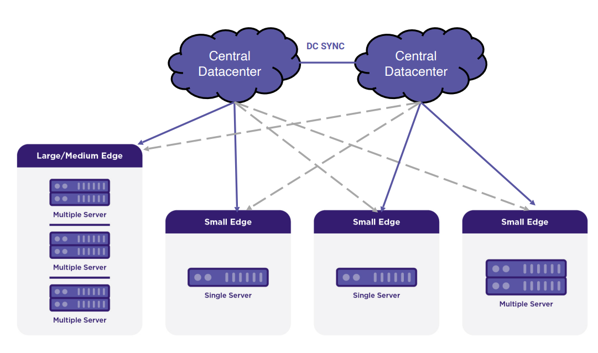

#### Central Datacenter thực hiện:
- Orchestration
- Synchronization
- Software Management
- Monitoring

#### Các Edge Site có thể triển khai:
- Small Edge (Single Server)
- Small Edge (Multi Server)
- Large/Medium Edge Cluster

## Rooted in the Edge

StarlingX được thiết kế để đáp ứng các yêu cầu khắt khe của Edge Computing.

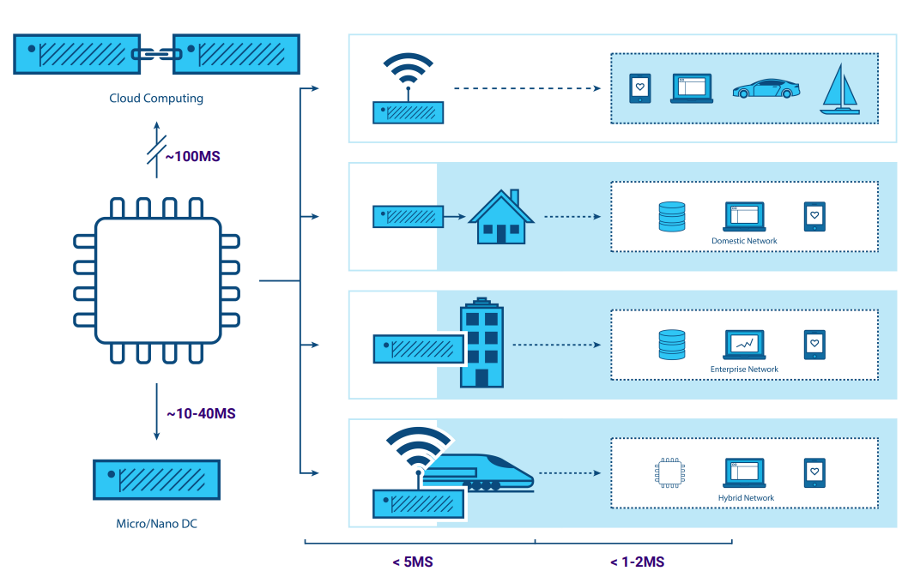

### Các yếu tố cốt lõi

#### Latency
- Cloud Datacenter: ~100 ms
- Regional Edge: ~10–40 ms
- Local Edge: <5 ms
- Real-time Processing: <1–2 ms

#### Bandwidth
- Giảm lưu lượng truyền về Cloud
- Xử lý dữ liệu tại chỗ

#### Security
- Bảo vệ dữ liệu tại Edge
- Hỗ trợ Sovereign Cloud

#### Connectivity
- Hoạt động khi WAN không ổn định
- Hỗ trợ môi trường kết nối hạn chế

# Why StarlingX?

StarlingX là nền tảng hạ tầng cloud **sẵn sàng triển khai (deployment-ready)**, **có khả năng mở rộng (scalable)** và **độ tin cậy cao (highly reliable)**, được thiết kế cho cả môi trường **Edge phân tán** và **Datacenter tập trung**.

## Kiến trúc tổng thể

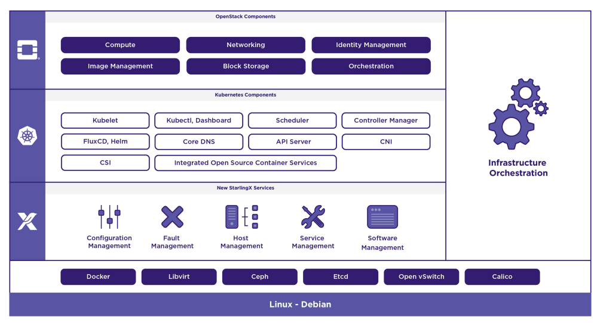

## Lợi ích chính

Các dịch vụ của nền tảng ảo hóa StarlingX tập trung vào:

- **Easy Deployment** – Triển khai đơn giản và nhanh chóng.
- **Low Touch Manageability** – Giảm thiểu công tác vận hành và quản trị.
- **Rapid Response to Events** – Phản ứng nhanh với các sự kiện và lỗi hệ thống.
- **Fast Recovery** – Khả năng phục hồi nhanh khi xảy ra sự cố.

## Nền tảng điều phối Edge hoàn chỉnh

StarlingX cung cấp một nền tảng điều phối hạ tầng Edge hoàn chỉnh cho cả:

- Container Workloads
- Virtual Machine (VM) Workloads

# StarlingX Cloud Platform


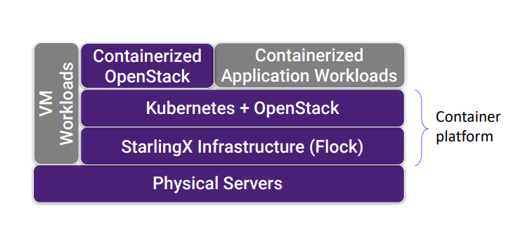

## Tổng quan

- Nền tảng cloud-native được tối ưu cho Kubernetes chạy trên máy chủ vật lý.
- Hỗ trợ tích hợp OpenStack Control Plane chạy container trên Kubernetes (tùy chọn).
- Quản lý đồng thời Container và Virtual Machine (VM) trên cùng nền tảng.

## Kiến trúc

```text
Containerized Applications
Containerized OpenStack
-------------------------
Kubernetes + OpenStack
StarlingX Infrastructure (Flock)
-------------------------
Physical Servers
```

## Điểm nổi bật

- Kubernetes và OpenStack tích hợp trên cùng nền tảng.
- Hỗ trợ cả Container Workloads và VM Workloads.
- Tối ưu cho Edge Cloud và Distributed Cloud.
- Triển khai đơn giản, vận hành tập trung.

# StarlingX Components

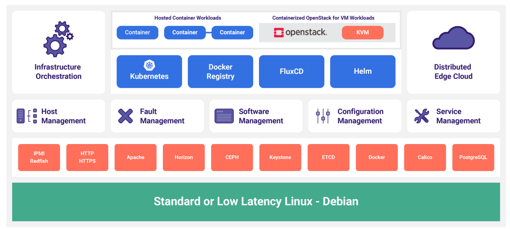

## Thành phần chính

### Workload Layer
- Container Workloads
- VM Workloads (OpenStack + KVM)

### Cloud Platform
- Kubernetes
- Docker Registry
- FluxCD
- Helm

### Management Services
- Host Management
- Fault Management
- Software Management
- Configuration Management
- Service Management

### Infrastructure Services
- IPMI / Redfish
- HTTP / HTTPS
- Apache
- Horizon
- Ceph
- Keystone
- ETCD
- Docker
- Calico
- PostgreSQL

### Operating System
- Debian Linux
- Hỗ trợ Standard Kernel hoặc Low-Latency Kernel

# StarlingX Deployment Models

## Khả năng mở rộng

- Standalone Cloud hỗ trợ đến **200 Kubernetes Worker Nodes**.
- Distributed Cloud hỗ trợ đến **5.000 Subclouds**.
- Mỗi Subcloud hỗ trợ đến **200 Kubernetes Worker Nodes**.

## Mô hình triển khai

### Standard Configuration
- Controller + Worker Nodes.
- Hỗ trợ mô hình 2 Controller/Master.
- Worker chỉ cần 1 CPU Core cho dịch vụ StarlingX.

### All-in-One (AIO)
- AIO-Simplex.
- AIO-Duplex.
- Chỉ cần 2 CPU Core để chạy các dịch vụ nền tảng StarlingX.

## Storage

- Hỗ trợ lưu trữ nội bộ dựa trên **Ceph/ROOK**.
- Hỗ trợ lưu trữ ngoài như:
    - NetApp
    - Dell PowerStore

# Infrastructure Management - "The Flock"

## Tổng quan

"The Flock" là bộ dịch vụ quản lý hạ tầng cốt lõi của StarlingX, chịu trách nhiệm:

- Quản lý cấu hình hệ thống.
- Quản lý vòng đời máy chủ.
- Quản lý dịch vụ nền tảng.
- Quản lý phần mềm và cập nhật.
- Giám sát và xử lý sự cố.

---

## Configuration Management

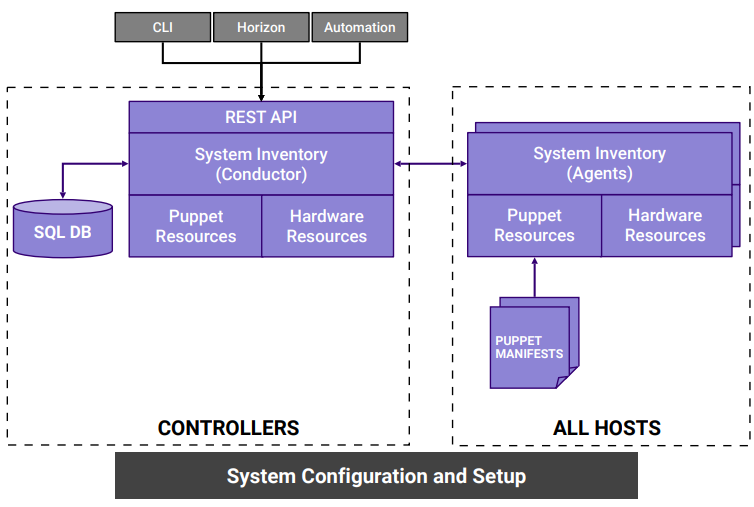

### Chức năng chính

#### Quản lý cài đặt (Installation Management)

- Tự động phát hiện node mới (Auto-discovery).
- Quản lý tham số cài đặt (console, root disk,...).
- Hỗ trợ triển khai hàng loạt qua file XML.

#### Quản lý cấu hình node

- Gán vai trò cho node.
- Cấu hình CPU, bộ nhớ, HugePages.
- Cấu hình mạng và lưu trữ.

#### Khám phá tài nguyên (Inventory Discovery)

- CPU, Core, SMT.
- Bộ nhớ và HugePages.
- Storage và Port.
- GPU và các thiết bị tăng tốc phần cứng.

### Kiến trúc

- REST API cung cấp giao diện quản trị.
- CLI, Horizon và Automation Tool truy cập qua API.
- Controller lưu trữ cấu hình trong SQL Database.
- Agent trên các Host thu thập thông tin phần cứng.
- Puppet được sử dụng để triển khai cấu hình xuống các node.
## Host Management

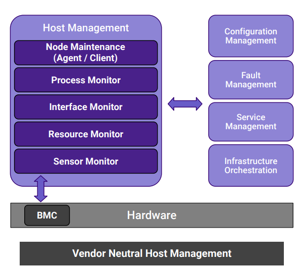

### Tổng quan

Host Management cung cấp khả năng quản lý toàn bộ vòng đời của máy chủ (Host Lifecycle Management) trong StarlingX.

#### Chức năng chính

- Quản lý vòng đời máy chủ.
- Tự động phát hiện lỗi và thực hiện khôi phục.
- Giám sát tài nguyên và trạng thái hệ thống.
- Tích hợp với BMC để quản lý phần cứng ngoài băng (Out-of-Band).

#### Thành phần

- Node Maintenance
- Process Monitor
- Interface Monitor
- Resource Monitor
- Sensor Monitor

#### Giám sát và cảnh báo

- Kết nối trong cụm (Cluster Connectivity).
- Trạng thái tiến trình quan trọng.
- Mức sử dụng CPU, RAM, tài nguyên hệ thống.
- Trạng thái giao diện mạng.
- Cảm biến phần cứng và watchdog.

#### Tích hợp BMC

- Reset máy chủ từ xa.
- Bật/Tắt nguồn.
- Giám sát cảm biến phần cứng.

#### Tích hợp với các dịch vụ khác

- Configuration Management
- Fault Management
- Service Management
- Infrastructure Orchestration
## Service Management

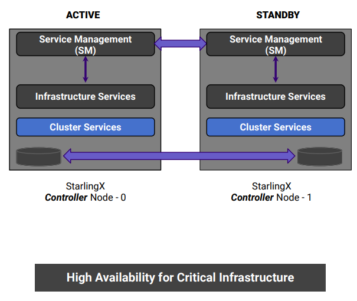

### Tổng quan

Service Management (SM) cung cấp khả năng quản lý tính sẵn sàng cao (High Availability) cho các dịch vụ hạ tầng trong StarlingX.

### Chức năng chính

- Quản lý High Availability (HA) cho các dịch vụ.
- Hỗ trợ mô hình dự phòng N+M hoặc N-node redundancy.
- Hiện hỗ trợ cụm Controller HA 1+1 (Active/Standby).
- Giám sát dịch vụ theo chế độ Active hoặc Passive.

### Đảm bảo tính sẵn sàng

- Hỗ trợ tối đa 3 đường truyền độc lập để tránh split-brain.
- Hỗ trợ LAG (Link Aggregation) để tăng khả năng dự phòng mạng.
- Xác thực thông điệp bằng HMAC SHA-512.
- Tự động phát hiện và xử lý lỗi dịch vụ.

### Kiến trúc

- Active Controller Node
    - Service Management (SM)
    - Infrastructure Services
    - Cluster Services

- Standby Controller Node
    - Service Management (SM)
    - Infrastructure Services
    - Cluster Services
## Fault Management

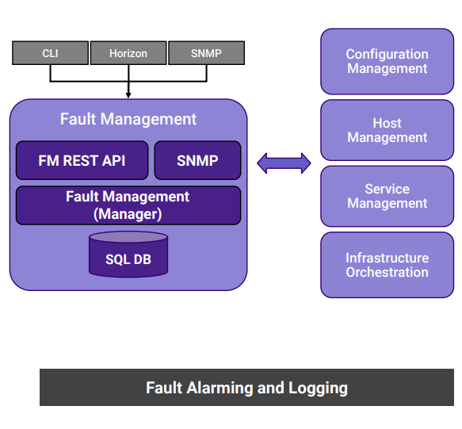

### Tổng quan

Fault Management (FM) cung cấp cơ chế giám sát, cảnh báo và ghi nhận sự kiện cho toàn bộ hạ tầng StarlingX.

### Chức năng chính

- Quản lý vòng đời cảnh báo (Alarm Lifecycle).
- Thiết lập, xóa và truy vấn cảnh báo qua API.
- Duy trì danh sách cảnh báo đang hoạt động (Active Alarm List).
- Cung cấp REST API và SNMP để tích hợp hệ thống giám sát.
- Hỗ trợ cơ chế Alarm Suppression.

### Quản lý cảnh báo

- Cảnh báo trên các node và tài nguyên hạ tầng.
- Cảnh báo trên tài nguyên ảo hóa (VM, Container).
- Theo dõi các sự kiện quan trọng của hệ thống.

### Quản lý sự kiện và log

- Ghi nhận sự kiện phát sinh và khôi phục cảnh báo.
- Lưu trữ nhật ký vận hành (Event Log).
- Theo dõi sự kiện liên quan đến:
  - Platform Nodes và Infrastructure Resources.
  - Virtual Resources và Workloads.

### Kiến trúc

- FM REST API
- SNMP Interface
- Fault Management Manager
- SQL Database

### Tích hợp với

- Configuration Management
- Host Management
- Service Management
- Infrastructure Orchestration

## Software Management

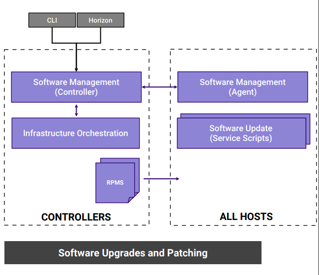

### Tổng quan

Software Management cung cấp cơ chế quản lý, cập nhật và nâng cấp phần mềm tập trung cho toàn bộ nền tảng StarlingX.

### Chức năng chính

- Tự động triển khai các bản vá bảo mật và tính năng mới.
- Hỗ trợ nâng cấp Rolling Upgrade không gián đoạn dịch vụ.
- Giảm thiểu số bước vận hành và không yêu cầu phần cứng bổ sung.
- Quản lý vòng đời phần mềm trên toàn cụm.

### Nâng cấp và cập nhật

- Hỗ trợ In-Service Patch (không cần reboot).
- Hỗ trợ các bản vá yêu cầu khởi động lại hệ thống.
- Sử dụng VM Live Migration để giảm thời gian gián đoạn khi nâng cấp.

### Phạm vi quản lý

- Hệ điều hành Host.
- Dịch vụ StarlingX.
- Các thành phần OpenStack.
- Các gói RPM và phần mềm nền tảng.

### Kiến trúc

- Software Management Controller
- Software Management Agent
- Software Update Scripts
- Infrastructure Orchestration
- RPM Repository

# Container Platform
## Kubernetes Cluster Software Components

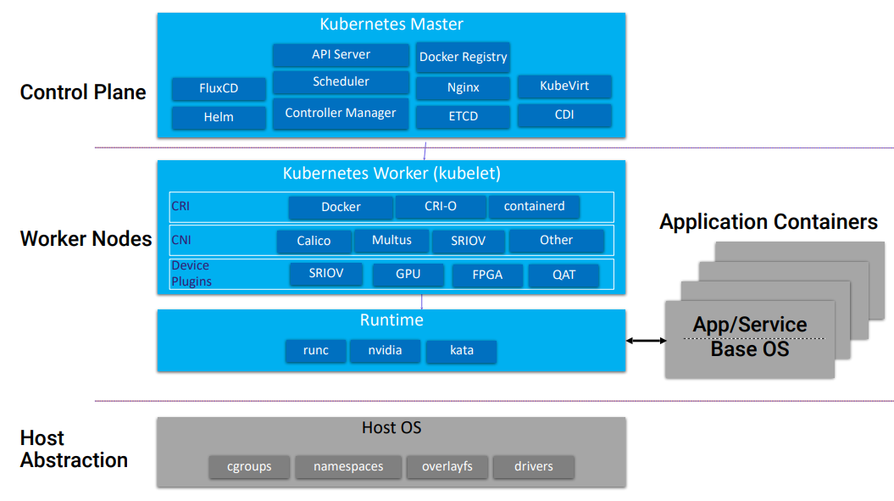

### Tổng quan

StarlingX cung cấp nền tảng Kubernetes hoàn chỉnh, hỗ trợ điều phối hạ tầng, container và các workload hiệu năng cao tại Edge hoặc Datacenter.

### Control Plane

Các thành phần chính của Kubernetes Master:

- API Server
- Scheduler
- Controller Manager
- ETCD
- FluxCD
- Helm
- Docker Registry
- Nginx
- KubeVirt
- CDI

### Worker Nodes

#### Container Runtime Interface (CRI)

- Docker
- CRI-O
- containerd

#### Container Network Interface (CNI)

- Calico
- Multus
- SR-IOV
- Other CNI Plugins

#### Device Plugins

- SR-IOV
- GPU
- FPGA
- Intel QAT

### Runtime

- runc
- NVIDIA Runtime
- Kata Containers

### Application Workloads

- Containerized Applications
- Application-specific Base OS
- VM Workloads thông qua KubeVirt

### Host OS Layer

- cgroups
- namespaces
- overlayfs
- kernel drivers

## Kubernetes Deployment Architecture

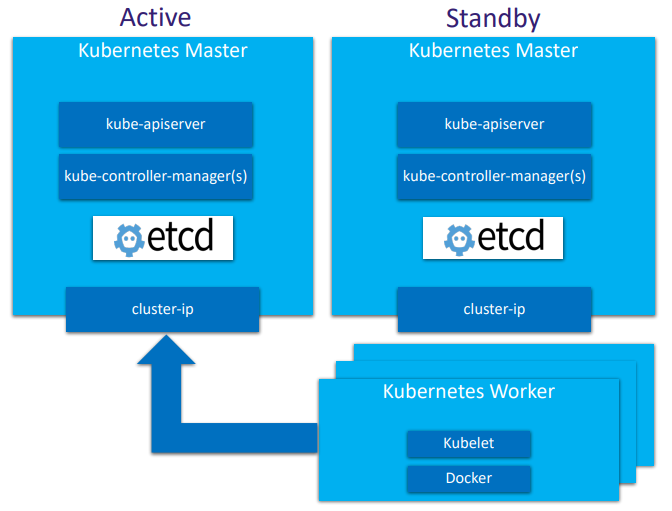

### Tổng quan

StarlingX triển khai Kubernetes theo mô hình High Availability (HA) nhằm đảm bảo tính sẵn sàng và khả năng phục hồi của Control Plane.

### Kiến trúc HA

- Mô hình Active / Standby (1:1).
- Hỗ trợ triển khai AIO-Simplex và AIO-Duplex.
- Truy cập dịch vụ thông qua Cluster Floating IP.
- Sử dụng DRBD để đồng bộ lưu trữ giữa các Controller.

### Thành phần

#### Kubernetes Master

- kube-apiserver
- kube-controller-manager
- etcd
- Cluster IP

#### Kubernetes Worker

- Kubelet
- Container Runtime (Docker)

### High Availability

- Service Management (SM) quản lý trạng thái dịch vụ.
- Giám sát Host, Service và Network.
- Tự động chuyển đổi (Failover) khi xảy ra sự cố.
- Giảm thiểu nguy cơ Split-Brain.
## Cluster Persistent Storage

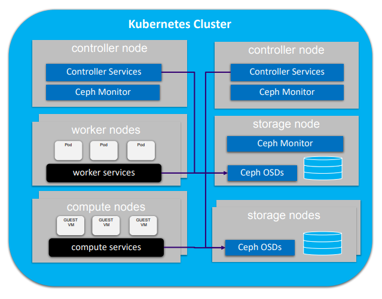

### Tổng quan

StarlingX sử dụng Ceph làm nền tảng lưu trữ phân tán, cung cấp Object, Block và File Storage trong một hệ thống thống nhất.

### Thành phần chính

- Ceph Monitor (MON)
- Ceph Object Storage Daemon (OSD)
- Controller Nodes
- Storage Nodes
- Worker/Compute Nodes

### Kubernetes Storage

- Cung cấp Persistent Storage thông qua Ceph RBD.
- Hỗ trợ:
    - Persistent Volume (PV)
    - Persistent Volume Claim (PVC)
- Có thể cấu hình làm StorageClass mặc định.

### Khả năng mở rộng

- Kiến trúc phân tán với nhiều MON và OSD.
- Hỗ trợ sao chép dữ liệu (Replication).
- Mở rộng dung lượng bằng cách bổ sung Storage Node.
- Phù hợp cho AIO, Standard và Distributed Cloud.

### Tích hợp Rook

- Hỗ trợ Rook để quản lý Ceph trên Kubernetes.
- Cho phép mở rộng thêm các backend lưu trữ khác.

### Tích hợp OpenStack

Ceph được sử dụng làm backend cho:

- Glance (Image Service)
- Cinder (Block Storage)
- Swift (Object Storage)
- Nova (Instance Storage)
## Kubernetes Cluster Networking

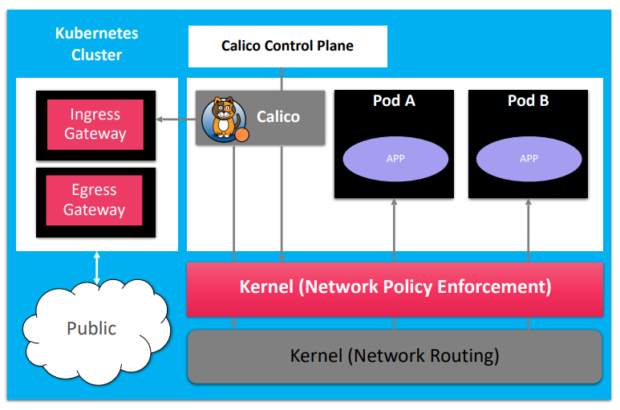

### Tổng quan

StarlingX sử dụng Calico làm giải pháp mạng mặc định cho Kubernetes, cung cấp kết nối L3 hiệu năng cao giữa các Pod và Node.

### Thành phần chính

- Calico Control Plane
- Ingress Gateway
- Egress Gateway
- Pod Networking
- Network Policy Enforcement
- Linux Kernel Routing

### Đặc điểm

- Mạng thuần Layer 3 (L3 Fabric).
- Sử dụng Linux Kernel để định tuyến và thực thi chính sách mạng.
- Hỗ trợ Border Gateway Protocol (BGP) cho Control Plane.
- Giải pháp mã nguồn mở dựa trên các tiêu chuẩn mở.

### Network Policy

- Kiểm soát truy cập giữa Pod, Namespace và Service.
- Thực thi chính sách bảo mật ở lớp L3/L4.
- Hỗ trợ phân tách lưu lượng giữa các workload.

### Khả năng mở rộng

- Không yêu cầu Overlay/Tunnel.
- Không cần VRF riêng biệt.
- Định tuyến trực tiếp (Pure Routing) giúp giảm overhead.
- Phù hợp cho môi trường Edge và Telco Cloud quy mô lớn.
## Kubernetes Accelerated Networking

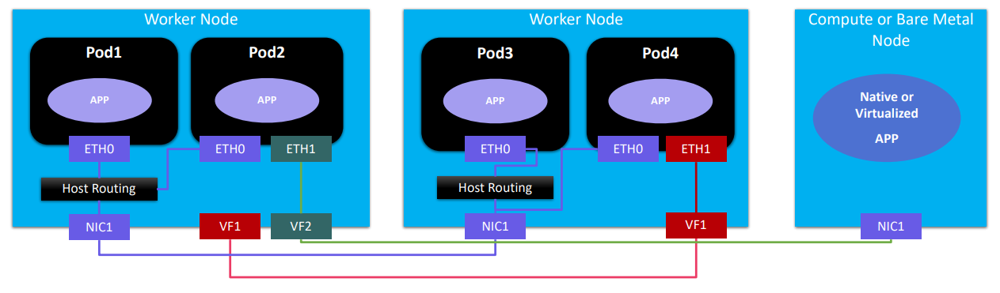

### Tổng quan

StarlingX hỗ trợ các công nghệ tăng tốc mạng nhằm đáp ứng yêu cầu hiệu năng cao của Telco Cloud, Edge Computing và các ứng dụng thời gian thực.

### Công nghệ hỗ trợ

- Multus CNI
- SR-IOV
- DPDK

### Cơ chế hoạt động

- Kubernetes quản lý các thiết bị mạng tăng tốc thông qua CNI và Device Plugin.
- Pod có thể sử dụng nhiều giao diện mạng (Multus).
- Container có thể truy cập trực tiếp Virtual Function (VF) hoặc thiết bị DPDK.
- SR-IOV cho phép bỏ qua Host Networking để tối ưu hiệu năng I/O.

### Thành phần

- Multus: hỗ trợ nhiều mạng cho Pod.
- SR-IOV: cấp phát Virtual Function (VF) trực tiếp cho Pod.
- DPDK: tăng tốc xử lý gói tin trong không gian người dùng (User Space).
- Device Plugin: quản lý và phân bổ tài nguyên phần cứng.

### Lợi ích

- Giảm độ trễ mạng.
- Tăng throughput và hiệu năng xử lý gói tin.
- Truy cập trực tiếp phần cứng mạng.
- Phù hợp với các workload yêu cầu hiệu năng cao như:
  - 5G Core
  - vRAN/Open RAN
  - MEC
  - AI/ML Edge
  - NFV/CNF
## Additional Capabilities

### Local Docker Registry

- Hỗ trợ Docker Image Registry cục bộ có cơ chế sao chép (replication).
- Giảm phụ thuộc vào registry bên ngoài.
- Phù hợp cho môi trường Edge và kết nối WAN hạn chế.

### Identity Management Integration

- Tích hợp với DEX (OIDC Proxy Identity Provider).
- Hỗ trợ xác thực thông qua:
    - OpenLDAP / SLAPD
    - Microsoft Active Directory
    - OIDC Identity Provider (ví dụ: Keycloak)

### Huge Page Support

- Hỗ trợ HugePages cho các workload hiệu năng cao.
- Pod có thể sử dụng HugePages đã được cấp phát trước trên Host.
- Giảm chi phí quản lý bộ nhớ và tăng hiệu năng.

### Kubernetes CPU Manager (Static Policy)

- Hỗ trợ gán CPU độc quyền cho Pod.
- Đảm bảo tài nguyên CPU dành riêng cho ứng dụng.
- Phù hợp với các workload thời gian thực và Telco Cloud.
## Application Management

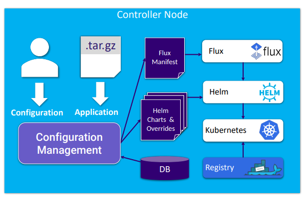

### Tổng quan

StarlingX cung cấp cơ chế triển khai và quản lý ứng dụng dựa trên Helm và Flux, giúp tự động hóa vòng đời ứng dụng trên Kubernetes.

### Helm

- Sử dụng Helm Chart để định nghĩa, cài đặt và nâng cấp ứng dụng.
- Triển khai theo mô hình template.
- Hỗ trợ kết hợp cấu hình hệ thống và cấu hình người dùng.

### Flux

- Quản lý và điều phối nhiều Helm Chart.
- Quản lý phụ thuộc giữa các thành phần ứng dụng.
- Cung cấp cấu hình mặc định và cấu hình tĩnh.

### Quản lý ứng dụng

- Đóng gói ứng dụng dưới dạng Helm Charts và Flux Manifest.
- Hỗ trợ tùy chỉnh cấu hình theo môi trường triển khai.
- Quản lý vòng đời ứng dụng thông qua Configuration Management.
- Cài đặt, cập nhật hoặc gỡ bỏ ứng dụng bằng thao tác đơn giản.

### Kiến trúc

- Configuration Management
- Flux Manifest
- Helm Charts & Overrides
- Flux
- Helm
- Kubernetes
- Container Registry
- Database

# OpenStack
## OpenStack Deployment

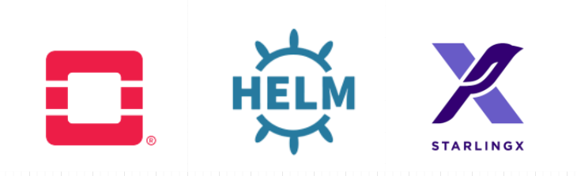

### Tổng quan

StarlingX triển khai OpenStack dưới dạng ứng dụng container chạy trên Kubernetes, kết hợp sức mạnh của OpenStack và Kubernetes trên cùng một nền tảng.

### Kiến trúc triển khai

- OpenStack Control Plane chạy dưới dạng Pod trên Kubernetes.
- Máy ảo (VM) chạy trực tiếp trên các Host.
- Sử dụng OVS hoặc OVS-DPDK làm vSwitch.
- Tận dụng Kubernetes để quản lý, mở rộng và cập nhật dịch vụ OpenStack.

### triển khai dựa vào công nghệ

- OpenStack-Helm
- Helm Charts
- FluxCD
- Kubernetes
- Open vSwitch (OVS)
- OVS-DPDK

### Quản lý ứng dụng

- Triển khai OpenStack thông qua Helm và FluxCD.
- StarlingX cung cấp API để cài đặt và cấu hình OpenStack.
- Hỗ trợ tự động sinh cấu hình Helm dựa trên cấu hình hệ thống.
- Cho phép tùy chỉnh cấu hình dịch vụ OpenStack dễ dàng.

### Thành phần gói triển khai

- Helm Charts
- Flux Manifests
- OpenStack Services Configuration
## Supported OpenStack Services

### Tổng quan

StarlingX cung cấp các dịch vụ OpenStack được tối ưu cấu hình và kiểm thử tích hợp sẵn trên nền tảng.

### Dịch vụ được hỗ trợ

| Service | Backend / Ghi chú |
|----------|------------------|
| **Cinder** | Rook Ceph nội bộ hoặc NetApp bên ngoài |
| **Glance** | Rook Ceph nội bộ hoặc NetApp bên ngoài |
| **Heat** | Dịch vụ Orchestration |
| **Horizon** | Dashboard quản trị OpenStack |
| **Keystone** | Local Database hoặc OIDC (DEX Identity Provider) |
| **Neutron** | OVS hoặc OVS-DPDK |
| **Nova** | Local LVM hoặc Rook Ceph cho ephemeral storage |

### Storage Backend

- Internal Rook Ceph
- External NetApp

### Identity & Authentication

- Local Database Authentication
- OIDC Authentication thông qua DEX

### Networking

- Open vSwitch (OVS)
- Open vSwitch with DPDK (OVS-DPDK)
## Day 2 Configuration Changes

### Tổng quan

StarlingX cho phép thay đổi cấu hình ứng dụng sau khi đã triển khai mà không cần cài đặt lại toàn bộ hệ thống.

### Quy trình cập nhật

1. Cập nhật Helm Chart Overrides.
2. Áp dụng lại (Reapply) ứng dụng.
3. Chỉ các thành phần bị ảnh hưởng mới được cập nhật.

### Cơ chế thực hiện

- `system helm-override-update`
- `system application-apply`

### Nâng cấp hệ thống

- Hỗ trợ nâng cấp StarlingX và OpenStack với thời gian gián đoạn tối thiểu.
- Hỗ trợ cập nhật định kỳ thông qua các bản phát hành SLURP.

# Distributed Cloud
## Distributed Cloud Overview

### Tổng quan

Distributed Cloud cho phép quản lý tập trung nhiều cụm Kubernetes và OpenStack phân tán trên nhiều khu vực địa lý từ một Central Cloud.

### Central Cloud (System Controller)

- Lưu trữ các dịch vụ dùng chung.
- Thực hiện điều phối hạ tầng trên toàn hệ thống.
- Hỗ trợ:
    - Cài đặt và triển khai hệ thống.
    - Tự động hóa vận hành.
    - Quản lý bản vá và nâng cấp phần mềm.
- Hỗ trợ mở rộng lên đến **5.000 site từ xa**.
- Hỗ trợ mô hình **Geo-Redundant Central Cloud**.

### Remote Sites (Subcloud)

- Hoạt động như các cloud độc lập.
- Được quản lý tập trung thông qua REST API và kết nối Layer 3.
- Có thể triển khai từ:
    - Single Server
    - Multi-Node Cluster
    - Hàng trăm máy chủ tại mỗi site

### Đặc điểm

- Hỗ trợ đồng thời Kubernetes và OpenStack.
- Quản lý tập trung nhiều Edge Site.
- Mở rộng quy mô lớn trên nhiều khu vực địa lý.
- Phù hợp với mô hình Distributed Edge Cloud.

### Kiến trúc tham chiếu

- Tuân theo mô hình **Distributed Control Plane** của OpenInfra Edge Computing Group.

## Distributed Cloud - System Controller

### Tổng quan

System Controller là thành phần trung tâm của mô hình Distributed Cloud, chịu trách nhiệm điều phối, quản lý và tự động hóa vận hành cho toàn bộ các Subcloud từ xa.

### Quản lý và điều phối tập trung

* Hỗ trợ mô hình Active-Active Geo-Redundant.
* Quản lý tập trung các Kubernetes/OpenStack Subcloud.
* Điều phối và tự động hóa vận hành trên các site từ xa.
* Hỗ trợ môi trường WAN có độ trễ cao hoặc kết nối không ổn định.
* Giám sát tình trạng hoạt động và sức khỏe của các Subcloud.

### Quản lý vòng đời hạ tầng

* Triển khai và cấu hình ban đầu.
* Backup & Restore.
* Software Patching & Upgrades.
* Certificate Management.
* Firmware Management.

### Dịch vụ dùng chung

* Keystone Authentication & Authorization đồng bộ trên toàn hệ thống.
* Docker Registry tập trung cho hạ tầng và ứng dụng.
* Horizon Dashboard tập trung (Single Pane of Glass).
* Quản lý dữ liệu nền tảng dùng chung:
    * DNS
    * NTP/PTP
    * API Firewall
    * SNMP
    * Các dịch vụ nền tảng khác
