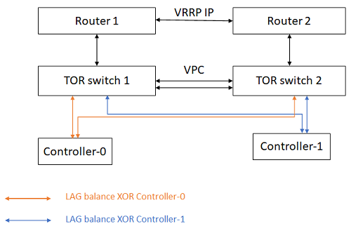

# Kế hoạch cài đặt và cấu hình kubernetes

## Tổng quan

Việc lập kế hoạch cài đặt và cấu hình StarlingX giúp triển khai nhanh chóng, đảm bảo đáp ứng yêu cầu vận hành hiện tại và khả năng mở rộng trong tương lai.

Quá trình lập kế hoạch hỗ trợ:

* Đáp ứng yêu cầu của container workload.
* Đáp ứng nhu cầu quản trị và vận hành cloud.
* Tích hợp với hạ tầng Data Center hoặc Telecom hiện có.
* Chuẩn bị cho việc mở rộng hệ thống trong tương lai.

## Các nội dung cần lập kế hoạch

### Network Planning

Thiết kế mạng cho hệ thống StarlingX.

### Storage Planning

Lập kế hoạch lưu trữ và dung lượng dữ liệu.

### Node Installation Planning

Lập kế hoạch cài đặt và triển khai các node.

### Node Resource Planning

Xác định tài nguyên CPU, RAM, Disk và Network cho từng node.

## Network Planning
### Network Requirements

StarlingX sử dụng nhiều loại mạng khác nhau tùy theo quy mô hệ thống và các tính năng được triển khai.

#### Các loại mạng chính

- **PXE Boot Network (tùy chọn)**: Dùng để cài đặt và khởi động node qua mạng.
- **Management Network**: Mạng nội bộ bắt buộc, phục vụ giao tiếp giữa các thành phần của hệ thống.
- **Cluster Host Network**: Mạng bắt buộc cho Kubernetes, hỗ trợ giao tiếp giữa các container và các node trong cụm.
- **OAM Network**: Mạng quản trị và vận hành, dùng để truy cập hệ thống từ bên ngoài.
- **External Network (tùy chọn)**: Cung cấp kết nối từ ứng dụng hoặc dịch vụ ra mạng ngoài.

#### Lưu ý

- Có thể gộp nhiều mạng trên cùng một giao diện vật lý bằng VLAN hoặc Multi-Netted Interface.
- Với hệ thống ít node, nên sử dụng subnet nhỏ để tiết kiệm địa chỉ IP và dễ quản lý.
- Mỗi node cần được cấp địa chỉ IP cho các mạng được sử dụng.
- Hệ thống có 2 controller yêu cầu hỗ trợ IP Multicast trên Management Network để đảm bảo đồng bộ giữa các controller.

### Networks for a System with Dedicated Storage

Đối với hệ thống sử dụng **Dedicated Storage**, StarlingX khuyến nghị triển khai đầy đủ các mạng để đảm bảo hiệu năng và khả năng mở rộng.

#### Cấu hình mạng khuyến nghị

- **Management Network (10GE)**
    - Quản lý hạ tầng nội bộ.
    - Truyền tải lưu lượng I/O giữa các node và Storage (Ceph).

- **OAM Network**
    - Quản trị và vận hành hệ thống từ bên ngoài.

- **Cluster Host Network**
    - Kết nối container-to-container trong Kubernetes.
    - Có thể dùng cho kết nối workload ra mạng ngoài.

- **External Network**
    - Cung cấp kết nối từ ứng dụng hoặc dịch vụ ra bên ngoài.

- **PXE Boot Network (tùy chọn)**
    - Cần khi Management Network sử dụng VLAN Tag.
    - Hoặc khi Management Network được chia sẻ với các thiết bị khác.

#### Lưu ý

- Nếu Cluster Host Network không được sử dụng cho kết nối bên ngoài, có thể dùng OAM Network hoặc các cổng mạng khác trên Controller và Worker.
- Với hệ thống tải trung bình, OAM Network có thể được gộp chung với Management Network để giảm số lượng giao diện mạng cần sử dụng.

### IP Support

StarlingX hỗ trợ cả **IPv4** và **IPv6** cho các mạng trong hệ thống.

> Tất cả các mạng phải sử dụng cùng một họ địa chỉ (IPv4 hoặc IPv6), ngoại trừ **PXE Boot Network**, mạng này luôn sử dụng IPv4.

#### Hỗ trợ IPv4 và IPv6

| Network | IPv4 | IPv6 | Ghi chú |
|----------|------|------|----------|
| PXE Boot Network | ✔ | ✘ | Chỉ hỗ trợ IPv4 do StarlingX chưa hỗ trợ IPv6 UEFI Boot. |
| Management Network | ✔ | ✔ | Hỗ trợ cả IPv4 và IPv6. |
| OAM Network | ✔ | ✔ | Hỗ trợ cả IPv4 và IPv6. |
| Cluster Host Network | ✔ | ✔ | Hỗ trợ cả IPv4 và IPv6 cho Kubernetes Cluster. |

#### Lưu ý

- PXE Boot Network phải là mạng **untagged**.
- Nếu sử dụng PXE Boot Network, mạng này được dùng để cài đặt và khởi động các node mới.
- Management, OAM và Cluster Host Network có thể được cấu hình bằng IPv4 hoặc IPv6.
- Không nên kết hợp IPv4 và IPv6 giữa các mạng trong cùng một hệ thống.

### PXE Boot Network

PXE Boot Network là mạng tùy chọn được sử dụng để khởi động và cài đặt các node mới thông qua PXE Boot.

Thông thường, StarlingX sử dụng **Management Network** cho PXE Boot nên không cần mạng PXE riêng.

#### Khi nào cần PXE Boot Network?

Cần triển khai PXE Boot Network khi:

- Management Network sử dụng VLAN Tag.
- Management Network cần hỗ trợ IPv6.
- Management Network không phù hợp cho PXE Boot.

Trong các trường hợp này, PXE Boot Network phải:

- Sử dụng **IPv4**.
- Là mạng **untagged**.

#### Lợi ích

- Tách biệt lưu lượng PXE Boot khỏi Management Network.
- Hỗ trợ các cấu hình mạng đặc biệt.
- Đơn giản hóa việc cài đặt và bổ sung node mới vào hệ thống.

> Lưu ý: StarlingX hiện không hỗ trợ PXE Boot qua IPv6, do đó PXE Boot Network luôn phải sử dụng IPv4.

### Cluster Host Network

Cluster Host Network là mạng vật lý bắt buộc cho Kubernetes trong StarlingX, cung cấp:

- Giao tiếp giữa các node trong cụm.
- Mạng nội bộ giữa container, pod và service.
- Hỗ trợ quản lý và điều khiển Kubernetes.

StarlingX sử dụng **Calico CNI** để xây dựng các mạng logic Kubernetes trên nền Cluster Host Network.

#### Đặc điểm

- Tất cả các node phải kết nối vào Cluster Host Network.
- Thường chia sẻ giao diện mạng với Management Network.
- Hỗ trợ giao tiếp container-to-container trong toàn cụm.

#### Kết nối ra bên ngoài

Workload có thể kết nối ra ngoài theo hai cách:

1. Thông qua **OAM Network** hoặc các cổng mạng được cấu hình riêng.
2. Sử dụng trực tiếp **Cluster Host Network** làm mạng external.

Các dịch vụ được publish thông qua:

- Kubernetes NodePort
- Ingress Controller
- Load Balancer

#### High Availability (HA)

HA cho ứng dụng có thể được triển khai bằng:

- Load Balancer bên ngoài.
- Nhiều bản ghi DNS trỏ tới các Controller/Worker Nodes.

#### Hỗ trợ BGP

Khi Cluster Host Network được sử dụng làm mạng external, Calico có thể:

- Quảng bá route thông qua BGP.
- Advertise Service IP hoặc Ingress IP.
- Kết nối với Router/Switch BGP bên ngoài.

Điều này cho phép workload Kubernetes được truy cập trực tiếp từ mạng bên ngoài mà không cần cấu hình route thủ công.

### Storage Network

Storage Network là mạng tùy chọn, chỉ cần thiết khi StarlingX sử dụng **NetApp Trident Cluster** làm backend lưu trữ bên ngoài.

#### Mục đích

- Kết nối các Controller Node và Worker Node tới NetApp Trident Cluster.
- Hỗ trợ truy cập và quản lý lưu trữ từ bên ngoài hệ thống StarlingX.

#### Đặc điểm

- Có thể sử dụng kết nối **10 GbE**.
- Hỗ trợ **VLAN Tagging** để chia sẻ giao diện với:
    - Management Network
    - OAM Network
- Có thể sử dụng toàn bộ hoặc một phần dải IP của subnet.
- Hỗ trợ:
    - Dynamic IP (DHCP)
    - Static IP

#### Lưu ý

- Chỉ triển khai khi sử dụng NetApp Trident Storage Backend.
- Các nguyên tắc thiết kế tương tự như Management Network.
- Không cần cấu hình Storage Network nếu sử dụng các giải pháp lưu trữ tích hợp như Ceph trong StarlingX.
### Internal management network
#### Internal Management Network Overview

Internal Management Network là mạng quản lý nội bộ dành riêng cho từng cụm StarlingX và được sử dụng cho giao tiếp giữa các thành phần của hệ thống.

> Một mạng Internal Management chỉ được sử dụng cho một cụm StarlingX duy nhất. Không hỗ trợ chia sẻ giữa nhiều cụm.

##### Vai trò

Trong quá trình cài đặt StarlingX, mạng này được sử dụng cho các dịch vụ:

- BOOTP
- DHCP
- PXE Boot

Các dịch vụ này giúp khởi tạo và đưa các node vào trạng thái hoạt động.

##### Yêu cầu

- Bắt buộc phải sẵn sàng trước khi cài đặt hệ thống.
- Mỗi node cần ít nhất một cổng mạng:
    - 1 GbE hoặc 10 GbE
- Cổng mạng phải:
    - Hỗ trợ PXE Boot.
    - Có thể được sử dụng làm thiết bị khởi động chính.

##### VLAN và IPv6

Internal Management Network có thể được cấu hình dưới dạng VLAN-tagged.

Trong trường hợp:

- Management Network sử dụng VLAN Tag.
- Hoặc cần hỗ trợ IPv6.

thì phải triển khai thêm:

- **PXE Boot Network riêng**
- Sử dụng IPv4
- Untagged trên cùng giao diện vật lý

##### Lưu ý

> Internal Management Network không được sử dụng trong mô hình **All-in-One Simplex (AIO-SX)**.


#### Kubernetes Internal Management Network Planning

Internal Management Network là mạng riêng tư, chỉ được sử dụng bởi các node trong cụm StarlingX.

> Mạng này không được sử dụng trong mô hình All-in-One Simplex (AIO-SX).

##### Yêu cầu và khuyến nghị

- Được sử dụng cho PXE Boot các node mới.
- Phải là mạng **untagged** nếu dùng cho PXE Boot.
- Chỉ hỗ trợ **IPv4** cho PXE Boot.

Nếu:

- Management Network sử dụng VLAN Tag.
- Hoặc cần hỗ trợ IPv6.

thì phải triển khai thêm một **PXE Boot Network riêng** sử dụng IPv4.

##### Giao diện mạng

- Có thể sử dụng cổng 1GbE hoặc 10GbE.
- Giao diện phải:
  - Hỗ trợ Network Boot (PXE).
  - Được cấu hình làm thiết bị khởi động chính trong BIOS.

##### Địa chỉ IP

- Khuyến nghị sử dụng dải IP riêng (RFC 1918):
    - 10.0.0.0/8
    - 172.16.0.0/12
    - 192.168.0.0/16
- Nên sử dụng subnet mặc định do StarlingX đề xuất.
- Có thể chỉ định một dải IP riêng cho StarlingX hoặc để StarlingX quản lý toàn bộ subnet.

##### Static IP Allocation

Nếu sử dụng IP tĩnh:

- Node mới sẽ không tự động được thêm vào hệ thống.
- Cần thêm thủ công bằng lệnh:

```bash
system host-add
```

### Multicast Subnets for the Management Network

Multicast Subnet xác định dải địa chỉ được sử dụng cho các dịch vụ multicast trên Management Network.

Mục đích chính là:

- Hỗ trợ giao tiếp multicast giữa các thành phần hệ thống.
- Tránh rò rỉ (multicast leak) giữa các vùng (region).
- Đảm bảo đồng bộ giữa các controller trong hệ thống HA.

##### Yêu cầu

- IPv4 Multicast:
    - Phạm vi: `224.0.0.0 - 239.255.255.255`

- IPv6 Multicast:
    - Khuyến nghị: `ffx5::/16`

- Mỗi region phải sử dụng dải multicast riêng.
- Không được trùng lặp với multicast subnet của region khác.
- Không được sử dụng các địa chỉ multicast đã được chuẩn hóa (well-known multicast addresses).
- Địa chỉ multicast phải duy nhất trong mạng.

##### Lưu ý thiết kế

- Khi nhiều region cùng nằm trên một L2 Network hoặc cùng subnet, mỗi region cần một multicast subnet riêng.
- Kích thước tối thiểu của multicast subnet là **16 địa chỉ host**.

> Các địa chỉ multicast này được sử dụng bởi dịch vụ hệ thống, không phải địa chỉ IP của host.

##### Yêu cầu đối với Switch

Nếu ToR Switch bật:

- IGMP Snooping (IPv4)
- MLD Snooping (IPv6)

thì cần triển khai:

- IGMP Querier
- MLD Querier

để tránh việc các node bị loại khỏi multicast group.

##### Giá trị mặc định

| Protocol | Default Multicast Subnet |
|-----------|-------------------------|
| IPv4 | `239.1.1.0/28` |
| IPv6 | `ff05::14:1:1:0/124` |

##### Tóm tắt

Trong các hệ thống StarlingX có HA (AIO-DX hoặc Standard System), multicast được sử dụng để đồng bộ và giao tiếp nội bộ. Vì vậy cần đảm bảo multicast subnet được thiết kế riêng biệt và switch hỗ trợ IGMP/MLD đúng cách.

### OAM Network
#### About the OAM Network

OAM (Operations, Administration and Maintenance) Network là mạng quản trị bên ngoài của StarlingX, cung cấp khả năng truy cập, vận hành và tích hợp với các dịch vụ bên ngoài.

##### Dịch vụ chính

- **DNS Service**: Phân giải tên miền cho các máy chủ và dịch vụ.
- **Docker Registry Service**: Cung cấp container images cho Kubernetes và StarlingX.
- **NTP Service**: Đồng bộ thời gian cho toàn bộ hệ thống.
- **PTP Service**: Đồng bộ thời gian độ chính xác cao cho các môi trường yêu cầu thời gian thực.

##### Đặc điểm

- Hỗ trợ truy cập quản trị hệ thống từ bên ngoài.
- Kết nối tới các dịch vụ hạ tầng như DNS, Registry, NTP/PTP.
- Worker và Storage Nodes đồng bộ thời gian thông qua Controller Nodes.
- Có thể sử dụng NTP hoặc PTP tùy theo yêu cầu triển khai.

> Đối với môi trường Telco hoặc Edge Computing, PTP thường được ưu tiên do yêu cầu đồng bộ thời gian chính xác cao.

#### OAM Network Planning

OAM Network là mạng quản trị bên ngoài, cho phép truy cập và quản lý cụm StarlingX từ xa.

##### Chức năng chính

- Truy cập Horizon Web Interface.
- Quản trị hệ thống qua SSH và SNMP.
- Truy cập REST API của StarlingX.
- Kết nối tới Docker Registry từ xa.
- Gửi log tới Remote Log Server (nếu cấu hình Remote Logging).
- Truy cập Board Management Controller (BMC/IPMI).

##### Thiết kế mạng

- Hỗ trợ IPv4 hoặc IPv6.
- Không hỗ trợ Dual-Stack.
- Tất cả các mạng trong hệ thống phải sử dụng cùng một họ địa chỉ IP (IPv4 hoặc IPv6).

##### Bảo mật

- Nên triển khai Firewall để bảo vệ giao diện quản trị.
- StarlingX hỗ trợ Firewall mặc định thông qua Kubernetes Network Policies.
- Có thể bổ sung các quy tắc Firewall tùy theo yêu cầu.

##### Kết nối bên ngoài

Cân nhắc giới hạn truy cập Internet nếu không cần thiết.

Tuy nhiên, OAM Network thường cần kết nối tới:

- DNS Server
- Docker Registry
- NTP/PTP Server
- Remote Logging Server

##### VLAN

OAM Network hỗ trợ VLAN Tagging và có thể chia sẻ giao diện vật lý với:

- Management Network
- Cluster Host Network

##### Địa chỉ IP

**IPv4**

- Chỉ cần OAM Floating IP được truy cập từ bên ngoài.
- IP vật lý của Controller có thể được giới hạn truy cập.
- Lưu lượng đi ra sử dụng IP vật lý của Controller làm địa chỉ nguồn.

**IPv6**

- Active Controller sử dụng OAM Floating IP làm địa chỉ nguồn.
- Secondary Controller sử dụng IP vật lý của chính nó.

##### High Availability

Đối với hệ thống có 2 Controller:

- Controller sử dụng IP Multicast trên Internal Management Network để đồng bộ.
- Cần cấu hình Switch hỗ trợ Multicast nhằm tránh mất đồng bộ giữa các Controller.

#### DNS and NTP Servers

StarlingX hỗ trợ cấu hình:

- Tối đa **3 DNS Servers**
- Tối đa **3 NTP Servers**

để phục vụ:

- Phân giải tên miền (DNS)
- Đồng bộ thời gian hệ thống (NTP)

##### DNS Servers

DNS được sử dụng để:

- Phân giải tên miền của các dịch vụ bên ngoài.
- Truy cập Docker Registry.
- Kết nối các dịch vụ quản lý và giám sát.

##### NTP Servers

NTP được sử dụng để:

- Đồng bộ thời gian cho Controller Nodes.
- Đảm bảo log và sự kiện trên toàn hệ thống có cùng mốc thời gian.
- Cung cấp nguồn thời gian cho Worker và Storage Nodes.

##### Thời điểm cấu hình

DNS và NTP Server có thể được khai báo:

- Trong quá trình bootstrap `controller-0`.
- Hoặc cấu hình bổ sung sau khi hệ thống đã được triển khai.

##### Khuyến nghị

- Cấu hình ít nhất 2–3 DNS Servers để tăng tính sẵn sàng.
- Cấu hình nhiều NTP Servers nhằm đảm bảo độ chính xác và dự phòng khi một nguồn thời gian gặp sự cố.

#### Firewall Options

StarlingX tích hợp sẵn Firewall cho OAM Network thông qua **Kubernetes Network Policies** sử dụng **Calico CNI**.

##### Quy tắc mặc định

Các quy tắc sau luôn được áp dụng:

- Cho phép toàn bộ lưu lượng không thuộc OAM Network.
- Cho phép toàn bộ lưu lượng đi ra (Egress).
- Cho phép lưu lượng Service Manager (SM).
- Cho phép SSH (TCP/22).

##### Tùy chỉnh Firewall

Có thể bổ sung hoặc ghi đè các quy tắc mặc định bằng cách tạo **Calico GlobalNetworkPolicy (GNP)**.

Ví dụ mở cổng HTTPS (TCP/443):

```yaml
apiVersion: crd.projectcalico.org/v1
kind: GlobalNetworkPolicy
metadata:
  name: gnp-oam-overrides
spec:
  ingress:
  - action: Allow
    protocol: TCP
    destination:
      ports:
      - 443
  order: 500
  selector: has(iftype) && iftype == 'oam'
  types:
  - Ingress
```
### L2 access switches
#### Kubernetes L2 Access Switches

L2 Access Switches kết nối các node StarlingX với các mạng khác nhau trong hệ thống. Việc cấu hình đúng các cổng switch là cần thiết để đảm bảo lưu lượng hoạt động ổn định.

##### Mô hình sử dụng một L2 Switch

Khi sử dụng chung một switch L2, cần tách biệt lưu lượng giữa các mạng bằng VLAN:

- Một VLAN cho:
    - Management Network
    - Cluster Host Network (mặc định dùng chung L2)

- Một VLAN cho:
    - OAM Network

- Một hoặc nhiều VLAN cho:
    - External Networks

##### Mô hình sử dụng nhiều L2 Switch

Có thể triển khai theo các cách sau:

- Một switch cho:
    - Management Network
    - Cluster Host Network
    - OAM Network

- Một hoặc nhiều switch riêng cho:
    - External Networks

- Hai switch dự phòng (Redundant Switches):
    - Link Aggregation (LACP)
    - Active/Standby Failover
    - vPC (Virtual Port Channel)

##### Cấu hình STP

Các cổng trunk mang lưu lượng VLAN-tagged sẽ tham gia STP (Spanning Tree Protocol).

Điều này có thể gây chậm vài giây khi cổng chuyển sang trạng thái Forwarding, ảnh hưởng tới:

- DHCP
- PXE Boot

##### Khuyến nghị

Đối với các cổng kết nối tới Management Interface:

- Bật **PortFast** để cổng chuyển ngay sang trạng thái Forwarding.
- Hạn chế hoặc vô hiệu hóa xử lý BPDU nếu phù hợp với chính sách mạng.
- Kiểm tra cấu hình STP theo hướng dẫn của nhà sản xuất switch.

##### Kết luận

Để đảm bảo quá trình PXE Boot, DHCP và quản trị hệ thống hoạt động ổn định, các cổng kết nối StarlingX nên được cấu hình VLAN phù hợp, bật PortFast và triển khai cơ chế dự phòng switch khi cần thiết.
#### Redundant Top-of-Rack (ToR) Switch Deployment Considerations

Đối với các hệ thống sử dụng **Link Aggregation (LAG/LACP)**, StarlingX khuyến nghị triển khai **Redundant ToR Switches** để tăng độ sẵn sàng và khả năng dự phòng.

##### Kiến trúc

Trong mô hình này:

- Mỗi đường link trong một LAG được kết nối tới các ToR Switch khác nhau.
- Nếu một switch gặp sự cố, switch còn lại vẫn duy trì kết nối cho hệ thống.



*Hình: Mô hình Redundant ToR Switches.*

##### Khuyến nghị sử dụng vPC

StarlingX khuyến nghị sử dụng các switch hỗ trợ **vPC (Virtual Port Channel)**.

Ưu điểm:

- Hai switch hoạt động đồng thời (Active-Active).
- Các link được xem như một LAG duy nhất.
- Tận dụng toàn bộ băng thông của các đường truyền.
- Hệ thống vẫn hoạt động khi một switch bị lỗi.
- Tăng khả năng chịu lỗi khi xảy ra mất nhiều link.

##### Mô hình Active/Standby

Có thể sử dụng mô hình Active/Standby nhưng không được khuyến nghị.

Nhược điểm:

- Chỉ một switch hoạt động tại một thời điểm.
- Không tận dụng được toàn bộ băng thông.
- Nếu chỉ còn một link hoạt động, băng thông bị giới hạn theo tốc độ của link đó.
- Khả năng chịu lỗi thấp hơn so với vPC.

##### Kết luận

Đối với môi trường Production, StarlingX khuyến nghị:

- Sử dụng **LACP + vPC**.
- Triển khai **2 ToR Switches** hoạt động đồng thời.
- Tránh mô hình Active/Standby nếu yêu cầu độ sẵn sàng và hiệu năng cao.

### Ethernet interfaces
#### About Ethernet Interfaces

Ethernet Interfaces (cả vật lý và ảo) đóng vai trò quan trọng trong hiệu năng và độ ổn định của hệ thống mạng StarlingX.

Việc lựa chọn loại interface và phương thức cấu hình phù hợp sẽ ảnh hưởng trực tiếp đến khả năng mở rộng, hiệu năng và tính sẵn sàng của hệ thống.

##### LAG / AE Interfaces

StarlingX hỗ trợ **LAG (Link Aggregation Group)**, còn gọi là **AE (Aggregated Ethernet)**.

Đặc điểm:

- Hỗ trợ tối đa **4 cổng mạng** trong một nhóm LAG.
- Tăng băng thông bằng cách gộp nhiều đường truyền vật lý.
- Cung cấp khả năng dự phòng khi một hoặc nhiều đường truyền gặp sự cố.
- Giảm nguy cơ gián đoạn kết nối.

##### Kết nối Switch

Các cổng trong một LAG có thể:

- Kết nối tới cùng một L2 Switch.
- Kết nối tới nhiều Switch trong mô hình dự phòng (Redundant ToR Switches).

##### Lợi ích

- Tăng băng thông mạng.
- Cải thiện độ sẵn sàng (High Availability).
- Hỗ trợ cân bằng tải giữa các liên kết.
- Đảm bảo kết nối liên tục khi xảy ra lỗi phần cứng hoặc đường truyền.

##### Khuyến nghị

- Sử dụng **LACP (802.3ad)** khi triển khai LAG.
- Kết hợp với **vPC/MLAG** nếu sử dụng hai ToR Switch để tăng khả năng dự phòng và tận dụng toàn bộ băng thông.
#### Ethernet Interface Configuration

StarlingX cho phép xem và chỉnh sửa cấu hình các Ethernet Interface (vật lý hoặc ảo) thông qua Horizon Web Interface hoặc CLI.

##### Physical Ethernet Interfaces

Các Ethernet Interface vật lý được sử dụng cho:

- Internal Management Network (mặc định chia sẻ cùng Cluster Host Network).
- OAM Network.
- Additional Networks cho kết nối workload ra bên ngoài.

##### Đặc điểm

- Một interface có thể phục vụ nhiều mạng bằng VLAN Tagging.
- Trên Controller Nodes, các interface được cấu hình tự động trong quá trình bootstrap.
- Trên Worker Nodes và Storage Nodes, chỉ interface Management được cấu hình sẵn; các interface còn lại cần cấu hình thủ công.
- Nếu sử dụng LAG (Link Aggregation), các interface tương ứng trên Worker và Storage Nodes phải được cấu hình thủ công với đúng loại interface.

##### Quản lý cấu hình

- Xem và chỉnh sửa cấu hình bằng Horizon hoặc CLI.
- Có thể lưu cấu hình interface của một node thành profile/template để áp dụng cho các node khác.

#### Ethernet MTU

MTU (Maximum Transmission Unit) là kích thước tối đa của dữ liệu có thể được truyền trong một Ethernet Frame.

##### Thông tin cơ bản

- MTU mặc định: **1500 bytes**
- MTU tối thiểu: **576 bytes**
- MTU tối đa: **9216 bytes**

##### Ethernet Frame

- Ethernet Header: 14 bytes
- CRC: 4 bytes

Do đó kích thước Ethernet Frame sẽ lớn hơn MTU **18 bytes**.

Ví dụ:

```text
MTU 1500
```
→ Ethernet Frame = 1518 bytes

#### Shared (VLAN or Multi-Netted) Ethernet Interfaces

StarlingX cho phép nhiều mạng cùng sử dụng một Ethernet Interface hoặc LAG Interface thông qua:

* **VLAN Tagging**
* **IP Multi-Netting**

Điều này giúp giảm số lượng cổng mạng vật lý cần sử dụng.

##### Các mạng có thể chia sẻ Interface

* Management Network
* Cluster Host Network
* OAM Network
* External Networks cho workload

> Nếu Management Network sử dụng VLAN Tagging thì phải nằm trên cùng interface dùng cho PXE Boot.

##### Các mô hình phổ biến

**1. Mặc định**

* Interface 1:

    * Management Network
    * Cluster Host Network (Multi-Netting)

* Interface 2:

    * OAM Network
    * External Access cho workload

**2. VLAN Tagging**

* Interface 1:

    * Management Network

* Interface 2:

    * OAM Network
    * Cluster Host Network

(Cùng chia sẻ bằng VLAN)

**3. Tách riêng từng mạng**

* Interface 1: Management Network
* Interface 2: OAM Network
* Interface 3: Cluster Host Network

**4. Thêm mạng ngoài riêng**

* Interface 1:

    * Management Network
    * Cluster Host Network

* Interface 2:

    * OAM Network

* Interface 3:

    * External Network cho workload

##### Cấu hình

Các tùy chọn VLAN Tagging và Multi-Netting có thể được khai báo trong:

* Ansible Bootstrap Playbook

Hoặc cấu hình bổ sung sau khi cài đặt bằng cách chỉnh sửa Interface.

##### Kết luận

VLAN Tagging và Multi-Netting giúp tối ưu số lượng cổng mạng, đồng thời cho phép linh hoạt thiết kế Management, OAM và Cluster Host Network tùy theo yêu cầu triển khai.

## Storage Planning
### Storage Resources

StarlingX sử dụng tài nguyên lưu trữ trên Controller, Worker và Storage Nodes (nếu có).

Cấu hình lưu trữ có thể thay đổi tùy theo mô hình triển khai và yêu cầu sử dụng.

#### Các loại lưu trữ

##### System Storage

Lưu trữ cho:

- Hệ điều hành.
- Cơ sở dữ liệu hệ thống.
- Các file cấu hình nền tảng.

Trong hệ thống HA, dữ liệu trên Controller được đồng bộ bằng **DRBD**.

##### Local Docker Registry

Controller Nodes triển khai Docker Registry cục bộ để lưu trữ container images.

- Hỗ trợ High Availability.
- Dữ liệu được đồng bộ bằng DRBD.

##### Container Images

Container Images được tải từ:

- Remote Registry.
- Local Registry.

Sau đó được cache trên Controller hoặc Worker Node.

##### Container Ephemeral Storage

Lưu trữ tạm thời cho container.

- Dữ liệu sẽ mất khi container bị xóa hoặc khởi động lại.
- Được cấp phát từ `docker-lv` và `kubelet-lv`.

##### Persistent Volume Claims (PVCs)

Lưu trữ dữ liệu lâu dài cho ứng dụng.

- Dữ liệu vẫn tồn tại sau khi container restart.
- Có thể sử dụng Ceph Storage hoặc NetApp Trident.

> Ceph không được cấu hình mặc định.

---

#### Vị trí lưu trữ

##### Controller Nodes

- Lưu dữ liệu hệ thống.
- Có thể chạy Ceph OSD để cung cấp PVC.

##### Worker Nodes

- Cung cấp Ephemeral Storage cho container.
- Có thể mở rộng bằng cách bổ sung disk vào `cgts-vg`.

##### Combined Controller-Worker Nodes

(AIO-SX / AIO-DX)

- Dùng chung disk cho hệ thống và container.
- Có thể triển khai Ceph phục vụ PVC.

##### Storage Nodes

(Chỉ trong mô hình Dedicated Storage)

- Chạy Ceph Cluster.
- Cung cấp Persistent Storage quy mô lớn.

---

#### External NetApp Trident

StarlingX hỗ trợ sử dụng NetApp Trident làm Storage Backend bên ngoài.

Các nền tảng được hỗ trợ:

- AWS Cloud Volumes
- NetApp ONTAP
- Azure NetApp Files
- Element HCI / SolidFire
- E-Series / EF-Series SAN

### Storage on Controller Hosts

Controller Hosts sử dụng root disk để lưu trữ hệ điều hành, cơ sở dữ liệu, container images, Docker Registry, backup và dữ liệu tạm thời của container.

#### Root Filesystem Storage

Root disk được chia thành nhiều filesystem phục vụ:

- Hệ điều hành và cấu hình hệ thống.
- Database.
- Docker Registry.
- Kubernetes Etcd.
- Platform Storage.

Các filesystem này có thể được mở rộng bằng Horizon hoặc CLI.

#### Synchronized Filesystems (DRBD)

Trên hệ thống HA, một số filesystem được đồng bộ giữa các Controller bằng DRBD:

- Platform Storage
- Database Storage
- Docker Registry Storage
- Etcd Storage
- Extension Storage

Điều này giúp đảm bảo dữ liệu luôn đồng nhất giữa các Controller.

#### Host Filesystems

Các filesystem cục bộ trên từng host gồm:

- **Backup**: Lưu dữ liệu backup hệ thống.
- **Docker**: Docker image cache và container storage.
- **Kubelet**: Ephemeral storage cho Kubernetes Pods.
- **Scratch**: Không gian lưu trữ tạm thời.
- **Logs**: Lưu log hệ thống (không thể resize).

#### Container Storage

##### Ephemeral Storage

- Được cấp phát từ `docker-lv` và `kubelet-lv`.
- Dữ liệu sẽ mất khi container bị xóa.

##### Persistent Volume Claims (PVCs)

- Dữ liệu được lưu trên Ceph Storage.
- Dữ liệu vẫn tồn tại sau khi container restart.

#### Ceph Storage cho PVC

Đối với:

- AIO-SX
- AIO-DX
- Standard Controller Storage

cần thêm disk trên Controller để triển khai Ceph OSD phục vụ PVC.

Yêu cầu tối thiểu:

- 2 disk bổ sung.
- Trong đó ít nhất 1 disk dùng làm Ceph OSD.

#### Replication

##### AIO-Simplex

Replication thực hiện giữa các OSD trên cùng host.

Hỗ trợ:

| Replication Factor | Số OSD tối thiểu |
|-------------------|------------------|
| 1 (mặc định) | 1 |
| 2 | 2 |
| 3 | 3 |

##### AIO-Duplex

Replication giữa hai Controller.

- Chỉ hỗ trợ Replication Factor = 2.
- Mỗi Controller cần tối thiểu 1 OSD.
- Khuyến nghị sử dụng cùng số lượng và dung lượng OSD trên cả hai Controller.
### Storage on Worker Hosts

Worker Hosts sử dụng root disk để lưu trữ cấu hình hệ thống, Docker images và dữ liệu tạm thời của container.

> Trong các hệ thống AIO-SX và AIO-DX, storage của Worker được cung cấp từ các tài nguyên trên Combined Controller-Worker Host.

#### Root Filesystem Storage

Dung lượng trên root disk được phân bổ cho các filesystem sau:

##### Docker Storage

- Lưu Docker image cache.
- Lưu dữ liệu tạm thời (ephemeral storage) của container.

##### Kubelet Storage

- Lưu trữ tạm thời cho Kubernetes Pods.
- Dữ liệu sẽ mất khi Pod bị xóa.

##### Scratch Storage

- Không gian lưu trữ tạm thời cho các tác vụ hệ thống.

##### Logs Storage

- Lưu log hệ thống.
- Không thể thay đổi kích thước.
- Log được rotate trong dung lượng đã cấp phát.

#### Lưu ý

- Có thể mở rộng Docker, Kubelet và Scratch Storage bằng Horizon hoặc CLI.
- Việc resize được thực hiện riêng trên từng Worker Host.

### Storage on Storage Hosts

Storage Hosts cung cấp một cụm **Ceph Storage** có tính sẵn sàng cao (HA) để lưu trữ Persistent Volume Claims (PVCs).

> Chỉ áp dụng cho mô hình **Standard Configuration with Dedicated Storage**.

#### Ceph Storage Cluster

- Ceph được kích hoạt tự động khi triển khai Dedicated Storage.
- Storage Hosts được tổ chức thành các Replication Groups để đảm bảo dự phòng dữ liệu.
- Hệ số nhân bản (Replication Factor) được cấu hình dựa trên số lượng Storage Hosts.

#### OSD Replication Factor

| Replication Factor | Hosts / Group | Max Groups |
|-------------------|---------------|------------|
| 2 | 2 | 4 |
| 3 | 3 | 3 |

#### Dung lượng lưu trữ

- Hỗ trợ tối đa **16 OSDs** trên mỗi Storage Host.
- Cần cấu hình dung lượng trước khi unlock host.
- Có thể mở rộng bằng cách:
    - Thêm OSD vào Storage Host hiện có.
    - Thêm Storage Host mới.

#### Hiệu năng

Storage Hosts hỗ trợ sử dụng:

- SSD
- NVMe SSD

để tăng tốc độ truy cập dữ liệu thông qua Ceph Journal.

#### Lợi ích

- Lưu trữ Persistent Volume Claims (PVCs).
- Dữ liệu được nhân bản và bảo vệ khỏi lỗi phần cứng.
- Dễ dàng mở rộng dung lượng và hiệu năng khi hệ thống phát triển.

## Security Planning
### Kubernetes UEFI Secure Boot Planning

UEFI Secure Boot giúp xác thực các thành phần hệ thống trước khi được phép thực thi, tăng cường bảo mật cho StarlingX.

#### Yêu cầu

- Hệ thống phải được cài đặt ở chế độ **UEFI** ngay từ đầu.
- Không hỗ trợ chuyển đổi từ Legacy BIOS sang UEFI sau khi cài đặt.
- Muốn sử dụng Secure Boot trên hệ thống cài theo Legacy phải cài đặt lại.

#### Chứng chỉ Secure Boot

- Chứng chỉ Secure Boot của StarlingX nằm trong file ISO.
- Đường dẫn:

```text
/CERTS
```
### TPM Planning

TPM (Trusted Platform Module) là bộ xử lý bảo mật chuyên dụng dùng để lưu trữ an toàn các khóa mã hóa và hỗ trợ các tính năng bảo mật nâng cao của StarlingX.

#### Mục đích

- Bảo vệ khóa riêng (Private Key) của HTTPS SSL.
- Tăng cường bảo mật cho REST API và Web Server.
- Hỗ trợ các tính năng bảo mật nâng cao của hệ thống.

#### Yêu cầu

- TPM là tùy chọn nhưng được khuyến nghị khi triển khai Secure Boot.
- Sử dụng thiết bị **TPM 2.0** tương thích.
- TPM phải được lắp đặt trên các Controller Nodes trước khi triển khai hệ thống.

#### Cấu hình

- BIOS phải nhận diện được TPM.
- TPM cần được bật trong BIOS trước khi sử dụng.
- Sau khi được kích hoạt, StarlingX có thể sử dụng TPM để bảo vệ các khóa SSL và dữ liệu bảo mật.

#### Lưu ý

- TPM thường được sử dụng cùng với UEFI Secure Boot để tăng cường bảo mật hệ thống.
- Nên kiểm tra tài liệu của nhà sản xuất máy chủ để xác nhận khả năng hỗ trợ TPM 2.0.

## Installation and resource Planning
### HTTPS Access Planning

StarlingX hỗ trợ HTTPS cho các dịch vụ bên ngoài nhằm tăng cường bảo mật và quản lý chứng chỉ tập trung.

#### Các thành phần hỗ trợ HTTPS

- StarlingX REST API và Web Administration Server
- Kubernetes API Server
- Local Docker Registry
- Trusted Certificate Authorities (CAs)

> StarlingX chỉ hỗ trợ chứng chỉ Self-Signed hoặc Root CA-Signed.

---

#### StarlingX REST API và Web UI

Mặc định:

- Sử dụng HTTP.
- Có thể bật HTTPS để tăng bảo mật.
- Khi bật HTTPS, HTTP sẽ bị vô hiệu hóa.

Lần đầu kích hoạt HTTPS:

- StarlingX tự động tạo Self-Signed Certificate.
- Client phải chấp nhận chứng chỉ này (Insecure Mode).

Khuyến nghị:

- Sử dụng chứng chỉ được ký bởi Root CA.
- Có thể thay đổi certificate và private key sau khi cài đặt.

##### TPM Support

StarlingX hỗ trợ lưu Private Key trong TPM 2.0 để tăng cường bảo mật.

---

#### Kubernetes

- HTTPS luôn được bật.
- Hệ thống tự tạo Kubernetes Root CA khi bootstrap.

Khuyến nghị:

- Thay thế Kubernetes Root CA mặc định bằng Root CA do tổ chức quản lý.
- Giúp các hệ thống bên ngoài tin cậy Kubernetes API Server.

---

#### Local Docker Registry

- HTTPS luôn được bật.
- Mặc định sử dụng Self-Signed Certificate.

Khuyến nghị:

- Thay bằng Root CA-Signed Certificate sau khi triển khai.
- Giúp các node và ứng dụng tin cậy Registry.

---

#### Trusted CAs

StarlingX cho phép cài đặt thêm Trusted CA trên toàn bộ hệ thống.

Ví dụ:

- External Docker Registry sử dụng CA nội bộ.
- Registry dùng chứng chỉ không thuộc các CA công khai.

Sau khi thêm Trusted CA:

- Controller Nodes
- Worker Nodes
- Storage Nodes

đều có thể xác thực và kết nối tới các dịch vụ sử dụng CA đó.

---

#### Khuyến nghị

- Sử dụng Root CA-Signed Certificates thay cho Self-Signed Certificates trong môi trường Production.
- Cấu hình Trusted CA nếu sử dụng Registry hoặc dịch vụ HTTPS nội bộ.
- Kết hợp TPM 2.0 để bảo vệ Private Key của các dịch vụ quan trọng.

### Hardware Requirements — Standard Configuration

| Requirement | Controller | Storage | Worker |
|------------|------------|----------|---------|
| Minimum Servers | 2 | 2–8 (RF=2)<br>3–9 (RF=3) | 2–100 |
| CPU | Dual Intel Xeon E5-26xx<br>8 cores/socket | Dual Intel Xeon E5-26xx<br>8 cores/socket | Dual Intel Xeon E5-26xx<br>8 cores/socket |
| Memory | 64 GB | 64 GB | 32 GB |
| Primary Disk | 500 GB SSD/NVMe | 500 GB SSD/NVMe | 120 GB |
| Additional Disk | 1 × 500 GB | 500 GB OSD Disk | 1 × 500 GB |
| Network | 2×10GE (Mgmt + Cluster Host)<br>2×1GE (OAM) | 2×10GE (Mgmt + Cluster Host) | 2×10GE (Mgmt + Cluster Host) |
| BMC/IPMI | Required | Required | Required |
| BIOS Mode | BIOS / UEFI | BIOS / UEFI | BIOS / UEFI |
| Hyperthreading | Enable/Disable | Enable/Disable | Enable/Disable |
| VT-x / VT-d | Disabled | Disabled | Enabled |

---

### Hardware Requirements — Simplex / Duplex

| Requirement | Controller + Worker |
|------------|---------------------|
| Minimum Servers | Simplex: 1<br>Duplex: 2 |
| CPU | Dual Intel Xeon E5-26xx (8 cores/socket)<br>hoặc Xeon D-15xx |
| Memory | 64 GB |
| Primary Disk | 500 GB SSD/NVMe |
| Additional Disk | 1 × 500 GB cho PVC Storage |
| Network | 2×10GE (Mgmt + Cluster Host)<br>2×1GE (OAM) |
| USB | 1 |
| BIOS Mode | BIOS / UEFI |
| Hyperthreading | Enable/Disable |
| VT-x / VT-d | Enabled |

---

### Interface Configuration Scenarios

| Scenario | Controller | Storage | Worker |
|----------|------------|----------|---------|
| Ít cổng mạng (≤ 2 cặp NIC) | 2×10GE LAG (Mgmt + Cluster Host)<br>2×1GE LAG (OAM) | 2×10GE LAG (Mgmt + Cluster Host) | 2×10GE LAG (Cluster Host) |
| Hiệu năng cao (>5G Storage Traffic) | 2×1GE LAG (Mgmt)<br>2×10GE LAG (Cluster Host)<br>2×1GE LAG (OAM) | 2×1GE LAG (Mgmt)<br>2×10GE LAG (Cluster Host) | 2×1GE LAG (Mgmt)<br>2×10GE LAG (Cluster Host) |

> Khuyến nghị sử dụng SSD/NVMe, LACP và giao diện mạng riêng cho Management, Cluster Host và OAM để đạt hiệu năng tốt nhất.

### System Boot Sequence Considerations

Trong quá trình cài đặt StarlingX, các node cần khởi động từ các thiết bị khác nhau ở từng giai đoạn triển khai.

#### Trình tự khởi động

##### Controller-0

- Khởi động từ USB hoặc DVD để cài đặt hệ điều hành.
- Sau khi cài đặt hoàn tất, khởi động từ ổ cứng.

##### Các node còn lại

- Khởi động qua PXE Network để cài đặt hệ điều hành.
- Sau khi cài đặt hoàn tất, khởi động từ ổ cứng.

#### Thứ tự Boot khuyến nghị

Cấu hình Boot Order trong BIOS như sau:

1. USB Flash Drive hoặc DVD
2. Hard Drive
3. PXE Boot qua Management Network
4. PXE Boot qua PXE Boot Network

#### Lưu ý

- Đảm bảo ổ cứng không chứa hệ điều hành có khả năng boot trước khi cài đặt.
- Kiểm tra NIC dùng cho PXE đã được kết nối đúng vào Management Network hoặc PXE Boot Network.
- Có thể cần điều chỉnh Boot Order trong BIOS tùy theo phần cứng của nhà sản xuất.

### Hard Drive Options

StarlingX hỗ trợ nhiều loại ổ đĩa lưu trữ, bao gồm:

- HDD (Rotational Disk)
- SSD (Solid State Drive)
- NVMe SSD

#### Khuyến nghị

- SSD cung cấp hiệu năng đọc/ghi cao hơn HDD.
- NVMe SSD cho hiệu năng cao nhất nhờ sử dụng giao tiếp PCIe thay vì SATA/SAS.
- Có thể sử dụng SSD hoặc NVMe thay thế cho HDD để tăng hiệu năng hệ thống.

#### Storage Hosts

Đối với Storage Hosts (Ceph):

- SSD hoặc NVMe được khuyến nghị cho:
    - Ceph Journal
    - Ceph Cache

giúp tăng tốc độ truy cập dữ liệu.

#### Sử dụng NVMe làm Root Disk

Yêu cầu:

- Máy chủ hỗ trợ NVMe trong BIOS.
- Có khe cắm hoặc adapter NVMe phù hợp.
- Bật chế độ UEFI trong BIOS.

Ngoài ra, cần cấu hình thêm trong quá trình cài đặt để đặt NVMe làm thiết bị khởi động (Boot Device).

#### Tóm tắt

| Loại ổ đĩa | Hiệu năng | Khuyến nghị |
|------------|-----------|-------------|
| HDD | Thấp | Chỉ dùng khi không yêu cầu hiệu năng cao |
| SSD | Cao | Phù hợp cho hầu hết hệ thống |
| NVMe SSD | Rất cao | Khuyến nghị cho Production và Ceph |

### Disk Configurations for StarlingX Simplex or Duplex Systems

| No. of Disks | Disk | BIOS Boot | Boot | Root | Platform VG (cgts-vg) | Unallocated Space | Ceph OSD (PVCs) | Notes |
|-------------|------|-----------|------|------|-----------------------|------------------|-----------------|-------|
| 1 | /dev/sda | - | - | - | - | - | - | Not supported |
| 2 | /dev/sda<br>/dev/sdb | /dev/sda1 | /dev/sda2 | /dev/sda3 | /dev/sda4 | Not allocated | 1 Disk | Space reserved for future application use.<br>AIO-SX (RF=1), AIO-DX (RF=2) |
| 2 | /dev/sda<br>/dev/sdb | /dev/sda1 | /dev/sda2 | /dev/sda3 | /dev/sda4 | /dev/sda5 (cgts-vg) | 1 Disk | Space added to cgts-vg for filesystem expansion.<br>AIO-SX (RF=1), AIO-DX (RF=2) |
| 3 | /dev/sda<br>/dev/sdb<br>/dev/sdc | /dev/sda1 | /dev/sda2 | /dev/sda3 | /dev/sda4 | Not allocated | 2 Disks | Space reserved for future application use.<br>AIO-SX (RF=2), AIO-DX (RF=2) |
| 3 | /dev/sda<br>/dev/sdb<br>/dev/sdc | /dev/sda1 | /dev/sda2 | /dev/sda3 | /dev/sda4 | /dev/sda5 (cgts-vg) | 2 Disks | Space added to cgts-vg for filesystem expansion.<br>AIO-SX (RF=2), AIO-DX (RF=2) |

#### Ghi chú

- **AIO-SX (Simplex)**:
    - 1 Ceph OSD → Replication Factor = 1
    - 2 Ceph OSDs → Replication Factor = 2

- **AIO-DX (Duplex)**:
    - Replication Factor luôn là 2

- Có thể sử dụng phần dung lượng chưa phân bổ (Unallocated Space) để:
    - Mở rộng `cgts-vg`
    - Tăng Docker Storage
    - Tăng Kubelet Storage
    - Tăng Ephemeral Storage cho container


