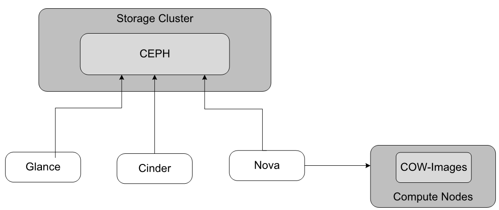

# Network planning
## IP Support

StarlingX hỗ trợ cả IPv4 và IPv6 cho các mạng trong hệ thống.

> Tất cả các mạng phải sử dụng cùng một họ địa chỉ (IPv4 hoặc IPv6), ngoại trừ PXE Boot Network chỉ hỗ trợ IPv4.

| Network | IPv4 | IPv6 | Ghi chú |
|----------|------|------|----------|
| PXE Boot | ✅ | ❌ | Chỉ hỗ trợ IPv4 và phải là mạng untagged. |
| Internal Management | ✅ | ✅ | Hỗ trợ cả IPv4 và IPv6. |
| OAM | ✅ | ✅ | Hỗ trợ cả IPv4 và IPv6. |
| Cluster Host | ✅ | ✅ | Hỗ trợ cả IPv4 và IPv6. |
| VXLAN Data Network | ✅ | ✅ | Flat/VLAN Data Network hỗ trợ IPv4 hoặc IPv6. |
| Project Networks, Routers, Metadata Server, SNAT, Floating IPs | ✅ | ⚠️ | Hỗ trợ DHCP và Routing IPv6, nhưng không hỗ trợ IPv6 cho Metadata Server, SNAT và Floating IPs. |

### Lưu ý

- PXE Boot Network luôn sử dụng IPv4.
- Không hỗ trợ Dual-Stack (IPv4 và IPv6 đồng thời).
- Cluster Host Network và OAM Network có thể sử dụng IPv4 hoặc IPv6.
- Floating IP và SNAT hiện chỉ hỗ trợ IPv4.

## PXE Boot Network

PXE Boot Network là mạng tùy chọn dùng để khởi động (PXE Boot) và cài đặt hệ điều hành cho các node trong StarlingX.

### Khi nào cần sử dụng?

Thông thường, PXE Boot sử dụng **Internal Management Network**, nên không cần mạng PXE riêng.

Tuy nhiên, cần triển khai PXE Boot Network khi:

- Internal Management Network sử dụng VLAN Tagging.
- Internal Management Network sử dụng IPv6.
- Không thể PXE Boot trực tiếp trên Management Network.

### Đặc điểm

- Là mạng **untagged**.
- Chỉ hỗ trợ **IPv4**.
- Dùng để PXE Boot và cài đặt các host mới.

### Lưu ý

> StarlingX không hỗ trợ PXE Boot qua IPv6.

Do đó, nếu Management Network sử dụng IPv6, phải triển khai thêm một PXE Boot Network riêng sử dụng IPv4.
## Internal Management Network

Internal Management Network là mạng nội bộ dành riêng cho từng cụm StarlingX OpenStack.

### Vai trò

- Quản lý và giao tiếp giữa các node trong cluster.
- Hỗ trợ các dịch vụ cài đặt:
    - BOOTP
    - DHCP
    - PXE
- Truyền lưu lượng Disk I/O giữa các node và Ceph Storage Cluster.

### Yêu cầu

- Phải là một mạng Layer 2 riêng biệt.
- Không được chia sẻ giữa nhiều StarlingX Clusters.
- Phải sẵn sàng trước khi bắt đầu cài đặt hệ thống.

### Interface

Có thể sử dụng:

- 1 GbE
- 10 GbE

Interface phải:

- Hỗ trợ PXE Boot.
- Có thể cấu hình làm thiết bị khởi động chính trong BIOS.

### VLAN và IPv6

Management Network có thể cấu hình VLAN Tagging.

Nếu:

- Management Network dùng VLAN Tagging, hoặc
- Management Network dùng IPv6

thì phải triển khai thêm một **PXE Boot Network IPv4** riêng (untagged) trên cùng interface vật lý.

### Ceph Storage

Management Network cũng được sử dụng cho giao tiếp giữa:

- Ceph Monitors
- Ceph OSDs

Do đó lưu lượng Ceph thường đi qua mạng này.

### Lưu ý

> Không sử dụng Internal Management Network trong mô hình Simplex.

> OSD giao tiếp với Monitor thông qua Management Network, vì vậy địa chỉ nguồn của OSD cũng sẽ thuộc mạng Management.

## Cluster Host Network

Cluster Host Network là mạng dùng cho Kubernetes Container Networking và traffic của OpenStack chạy dưới dạng container.

### Vai trò

- Kết nối tất cả các node trong cluster.
- Cung cấp mạng cho Kubernetes Pods và Containers.
- Truyền tải lưu lượng điều khiển (Control Plane Traffic) của OpenStack Containerized Services.

### Yêu cầu

- Tất cả các node phải được kết nối vào Cluster Host Network.
- Đây là mạng bắt buộc trong hệ thống StarlingX OpenStack.

### Triển khai

Mặc định:

- Cluster Host Network dùng chung interface và cùng mạng L2 với Management Network.

Tùy chọn:

- Có thể triển khai trên một interface riêng nếu cần tách biệt lưu lượng.

### Truy cập từ bên ngoài

Các OpenStack Service Endpoints được expose ra bên ngoài thông qua:

- NGINX Ingress Controller

NGINX sử dụng:

- Host Networking
- Cổng 80 (HTTP)
- Cổng 443 (HTTPS)

và được truy cập thông qua **OAM Floating IP**.

### Tóm tắt

| Thành phần | Chức năng |
|------------|-----------|
| Cluster Host Network | Kubernetes Container Networking |
| Management Network | Quản lý nội bộ hệ thống, Traffic CEPH |
| NGINX Ingress | Expose OpenStack Services |
| OAM Floating IP | Truy cập từ bên ngoài |

## OAM Network

OAM (Operations, Administration and Maintenance) Network là mạng cung cấp truy cập từ bên ngoài tới các dịch vụ OpenStack và giao diện quản trị Horizon.

### Vai trò

- Truy cập OpenStack External API Endpoints.
- Truy cập OpenStack Horizon Web Interface.
- Cung cấp kết nối quản trị từ bên ngoài vào hệ thống.

### Dịch vụ truy cập qua OAM

- OpenStack APIs
- Horizon Dashboard
- Các dịch vụ quản trị và vận hành hệ thống

### Bảo mật

- Hỗ trợ HTTPS để bảo vệ kết nối trên OAM Network.
- Khuyến nghị sử dụng chứng chỉ được ký bởi CA tin cậy trong môi trường Production.

### Lưu ý

Ngoài việc cung cấp truy cập từ bên ngoài, OAM Network còn được sử dụng để kết nối tới các dịch vụ hạ tầng như:

- DNS Server
- Docker Registry
- NTP/PTP Server
- Remote Logging
## Data Networks

Data Networks là các mạng dữ liệu được sử dụng bởi OpenStack để cung cấp kết nối cho VM và Project Networks.

### Vai trò

- Là mạng nền tảng (backing network) cho Overlay Networks.
- Ảnh hưởng trực tiếp đến hiệu năng mạng của VM.
- Hỗ trợ các công nghệ như:
    - VLAN
    - VXLAN
    - SR-IOV
    - PCI Passthrough

---

### Physical Network Planning

Khi thiết kế Data Network cần xem xét:

- Băng thông mạng.
- Độ trễ.
- QoS.
- NUMA Topology của máy chủ.

Hiệu năng của VM phụ thuộc trực tiếp vào cách bố trí CPU, Memory và NIC trên cùng NUMA Node.

---

### Resource Placement

Để đạt hiệu năng tối đa:

- VM
- Memory
- NIC
- SR-IOV VF
- PCI Passthrough Device

nên nằm trên cùng một NUMA Node.

#### Tùy chọn NUMA Affinity

**Strict Affinity**

- VM phải chạy trên NUMA Node chứa PCI Device.
- Nếu không đáp ứng được sẽ không được schedule.

**Prefer Affinity**

- Scheduler ưu tiên NUMA Node chứa PCI Device.
- Nếu không có vẫn cho phép khởi tạo VM.

> Strict Affinity cho hiệu năng và tính xác định cao nhất.

---

### OpenStack L2 Access Switches

L2 Access Switches kết nối các node OpenStack với các mạng khác nhau.

#### Mô hình dùng một Switch

Khuyến nghị tách VLAN:

- VLAN Management + Cluster Host
- VLAN OAM
- VLAN Data Networks

Ví dụ phân chia QoS:

- Bronze Projects
- Silver Projects
- Gold Projects

---

#### Mô hình dùng nhiều Switch

Có thể triển khai:

- Một switch cho:
    - Management
    - Cluster Host
    - OAM

- Một hoặc nhiều switch riêng cho:
    - Data Networks

- Hai switch dự phòng:
    - LACP
    - vPC
    - Active/Standby

---

### Khuyến nghị

- Sử dụng VLAN để tách biệt lưu lượng.
- Dùng LACP hoặc vPC để tăng HA và băng thông.
- Với SR-IOV hoặc PCI Passthrough, nên cấu hình NUMA Affinity để đạt hiệu năng tối đa.

## Ethernet Interfaces

Ethernet Interfaces (vật lý và ảo) đóng vai trò quan trọng đối với hiệu năng mạng của StarlingX OpenStack.

### LAG/AE Interfaces

StarlingX OpenStack hỗ trợ:

- LAG (Link Aggregation Group)
- AE (Aggregated Ethernet)

Đặc điểm:

- Tối đa 4 cổng trong một nhóm LAG.
- Tăng băng thông và khả năng dự phòng.
- Có thể kết nối:
    - Cùng một L2 Switch.
    - Nhiều Switch trong mô hình dự phòng (vPC/LACP).

---

### Ethernet Interface Configuration

#### Physical Ethernet Interfaces

Các interface vật lý được sử dụng cho:

- Internal Management Network
- Cluster Host Network
- OAM Network
- Data Networks

Một interface có thể phục vụ nhiều mạng bằng:

- VLAN Tagging
- IP Multi-Netting

#### Virtual Ethernet Interfaces

Các interface ảo của VM được tạo khi khởi động Instance.

Các loại interface hỗ trợ:

| Loại | Mô tả |
|--------|--------|
| virtio | Driver mạng hiệu năng cao |
| AVP | Accelerated Virtual Port |
| ne2k_pci | NE2000 Emulation |
| pcnet | AMD PCnet Emulation |
| rtl8139 | Realtek Emulation |
| pci-passthrough | PCI Passthrough |
| pci-sriov | SR-IOV |

#### Tăng tốc mạng

StarlingX OpenStack hỗ trợ:

- AVR (Accelerated Virtual Router)
- SR-IOV
- PCI Passthrough
- PCI Hardware Accelerators

> SR-IOV và PCI Passthrough cho hiệu năng rất cao nhưng không hỗ trợ Live Migration, QoS hoặc LAG do OpenStack quản lý.

---

### Ethernet MTU

MTU là kích thước dữ liệu tối đa của một Ethernet Frame.

#### Giá trị hỗ trợ

| Thông số | Giá trị |
|-----------|----------|
| Default MTU | 1500 |
| Minimum MTU | 576 |
| Maximum MTU | 9216 |

#### Kích thước Frame

| Loại mạng | Frame Size |
|------------|------------|
| Ethernet | MTU + 18 bytes |
| VLAN | MTU + 22 bytes |
| VXLAN IPv4 | MTU + 54 bytes |
| VXLAN IPv6 | MTU + 74 bytes |

#### Lưu ý

- Cluster Host Interface luôn sử dụng MTU = 1500.
- MTU trên Switch và Interface phải tương thích.
- Với VXLAN, nên cấu hình MTU khoảng **1600** để tránh phân mảnh gói tin.
- Data Interface phải có MTU ≥ Data Network MTU.

---

### Shared (VLAN or Multi-Netted) Ethernet Interfaces

StarlingX cho phép nhiều mạng cùng chia sẻ một Ethernet Interface hoặc LAG Interface.

#### Phương thức chia sẻ

- VLAN Tagging
- IP Multi-Netting

#### Các mô hình phổ biến

##### Mặc định

- Interface 1:
    - Management Network
    - Cluster Host Network

- Interface 2:
    - OAM Network

- Interface 3+:
    - Data Networks

##### Tách riêng từng mạng

- Interface 1: Management
- Interface 2: OAM
- Interface 3: Cluster Host
- Interface 4+: Data Networks

##### VLAN Tagging

- Management, OAM và Cluster Host cùng chia sẻ một interface bằng VLAN.

#### Lưu ý

> Nếu Management Network sử dụng VLAN Tagging thì phải nằm trên cùng interface dùng cho PXE Boot.# Storage planning
## Virtual Networks

StarlingX OpenStack sử dụng:

- Data Networks (Flat/VLAN/VXLAN)
- Project Networks

Data Networks cung cấp kết nối vật lý cho các Project Networks và VM.

Project Networks là các mạng logic được sử dụng bởi tenant và máy ảo.

> VLAN và VXLAN là hai loại Data Network phổ biến nhất.

# Storage planning
## Storage Resources

StarlingX OpenStack sử dụng tài nguyên lưu trữ trên Controller, Compute và Storage Hosts để cung cấp dịch vụ lưu trữ cho hệ thống và máy ảo.

### Storage Services and Backends


| Service | Chức năng | Backend |
|----------|----------|----------|
| Cinder | Block Storage cho VM | Ceph |
| Glance | Lưu VM Images | Ceph |
| Nova | Ephemeral Disk của VM | Local Disk (CoW-Image trên Compute Nodes) hoặc Ceph |

### Uses of Disk Storage

#### Containerized OpenStack System

Các container của StarlingX OpenStack sử dụng kết hợp:

- Local Container Ephemeral Storage.
- Persistent Volume Claims (PVCs) được cung cấp bởi Ceph.
- MariaDB HA cho cơ sở dữ liệu và dữ liệu cấu hình.

#### VM Ephemeral Boot Disk Volumes

(Khởi động VM từ Image)

- Nova tạo local ephemeral boot disk trên Compute Node.
- Disk được tạo khi VM khởi động.
- Disk sẽ bị xóa khi VM bị xóa.

#### VM Persistent Boot Disk Volumes

(Khởi động VM từ Cinder Volume)

- Root Disk của VM được lưu trên Ceph thông qua Cinder.
- Dữ liệu vẫn tồn tại sau khi VM tắt hoặc di chuyển.
- Có thể cung cấp thêm Cinder Volumes cho VM khởi động từ Image.

#### VM Additional Disks

VM có thể sử dụng thêm các Local Ephemeral Disks như:

- Swap Disk
- Temporary Data Disk

Các disk này:

- Được tạo khi VM khởi động.
- Bị xóa khi VM bị xóa.

#### VM Block Storage Backups

- Cinder Volumes có thể được sao lưu.
- Backup được lưu trong một Ceph Pool riêng để lưu trữ dài hạn.

---

### Storage Locations

Ngoài lưu trữ cho các OpenStack Containers, hệ thống có thể sử dụng các vị trí lưu trữ sau.

#### Controller Hosts

(Deployment: Standard with Controller Storage)

Một hoặc nhiều ổ đĩa trên Controller có thể được sử dụng để triển khai một cụm Ceph nhỏ cung cấp backend cho:

- Cinder Volumes
- Cinder Backups
- Glance Images
- Remote Nova Ephemeral Volumes

#### Compute Hosts

Một hoặc nhiều ổ đĩa trên Compute Node có thể được sử dụng cho:

- Nova Local Ephemeral Storage

dành cho máy ảo.

#### Combined Controller-Compute Hosts

(Simplex hoặc Duplex)

Một hoặc nhiều ổ đĩa được sử dụng để cung cấp:

- Local Nova Ephemeral Storage cho VM.
- Ceph Storage Cluster nhỏ cho:
  - Cinder
  - Glance
  - Remote Nova Ephemeral Storage

#### Storage Hosts

(Deployment: Dedicated Storage)

Một hoặc nhiều ổ đĩa trên Storage Host được sử dụng để xây dựng cụm Ceph quy mô lớn cung cấp backend cho:

- Cinder
- Glance
- Remote Nova Ephemeral Storage

Storage Hosts chỉ được sử dụng trong mô hình Dedicated Storage.
## Storage Configurations

StarlingX OpenStack hỗ trợ nhiều mô hình lưu trữ khác nhau tùy theo kiến trúc triển khai.

Bao gồm:

- Storage on Controller Hosts
- Storage on Storage Hosts
- Storage on Compute Hosts

---

### Storage on Controller Hosts

Controller Hosts cung cấp lưu trữ cho các OpenStack Controller Services thông qua:

- Local Container Ephemeral Storage
- Persistent Volume Claims (PVCs) được cung cấp bởi Ceph
- Containerized HA MariaDB

Đối với hệ thống sử dụng **Controller Storage**, cụm Ceph nhỏ trên Controller còn cung cấp:

- Glance Image Storage
- Cinder Block Storage
- Cinder Backup Storage
- Nova Remote Ephemeral Storage

Trên hệ thống:

- All-in-One Simplex (AIO-SX)
- All-in-One Duplex (AIO-DX)

Controller đồng thời đóng vai trò Compute Node nên cũng cung cấp:

- Nova Local Storage cho VM Ephemeral Disks

#### Underlying Platform Filesystem Storage

- Root Disk của Controller được dành riêng cho hệ thống.
- Khi thay thế ổ đĩa, cần lắp đặt trước khi thay đổi dung lượng các filesystem.

#### Glance, Cinder và Remote Nova Storage

Cụm Ceph trên Controller được sử dụng để lưu trữ:

- Glance Images
- Cinder Volumes
- Cinder Backups
- Nova Remote Ephemeral Volumes

#### Nova-Local Storage

Trên AIO-SX và AIO-DX:

- Controller cung cấp Nova Local Storage cho VM Ephemeral Disks.

Trên hệ thống Standard:

- Nova Local Storage được cung cấp bởi Compute Hosts.

Có thể mở rộng dung lượng bằng cách thêm Physical Volume thông qua:

```bash
system host-pv-add
```

---

### Storage on Storage Hosts

Storage Hosts cung cấp cụm Ceph chuyên dụng cho OpenStack.

StarlingX tự động tạo các Ceph Pools mặc định cho:

- Glance Images
- Cinder Volumes
- Cinder Backups
- Nova Ephemeral Storage

Mô hình này được sử dụng trong hệ thống:

- Standard with Dedicated Storage

---

### Storage on Compute Hosts

Compute-labelled Worker Hosts có thể cung cấp:

- Nova Ephemeral Storage

cho VM.

Các Ephemeral Disks:

- Được tạo khi VM khởi động.
- Bị xóa khi VM bị xóa.
- Không dùng để lưu trữ dữ liệu lâu dài.

---

### Tóm tắt

| Thành phần | Chức năng lưu trữ |
|------------|------------------|
| Controller Hosts | OpenStack Services, Ceph Storage, Nova Local Storage (AIO) |
| Storage Hosts | Ceph Storage Cluster |
| Compute Hosts | Nova Ephemeral Storage |
| Glance | VM Images |
| Cinder | Persistent Volumes |
| Nova Local | Ephemeral VM Disks |
| Ceph | Backend lưu trữ tập trung |

## Block Storage for Virtual Machines

StarlingX OpenStack hỗ trợ hai loại lưu trữ chính cho máy ảo:

- Ephemeral Storage
- Persistent Storage

---

### Nova Ephemeral Storage

Nova Ephemeral Storage là ổ đĩa cục bộ được tạo khi VM khởi động.

Đặc điểm:

- Được lưu trên Compute Host.
- Tự động tạo khi VM được khởi tạo từ Image.
- Bị xóa khi VM bị xóa.
- Không phù hợp để lưu trữ dữ liệu lâu dài.

#### Sử dụng

- Root Disk khi boot từ Image.
- Swap Disk.
- Temporary Data Disk.

---

### Cinder Persistent Storage

Cinder cung cấp Block Storage lâu dài cho VM.

Đặc điểm:

- Được lưu trên Ceph Storage Cluster.
- Dữ liệu vẫn tồn tại sau khi VM tắt hoặc xóa.
- Có thể snapshot và backup.

#### Sử dụng

- Boot from Volume.
- Data Volume.
- Database Storage.
- Persistent Application Storage.

---

### Ceph Storage Backend

Ceph là backend lưu trữ mặc định của StarlingX OpenStack.

Ceph cung cấp:

- Glance Image Storage
- Cinder Volumes
- Cinder Backups
- Nova Remote Ephemeral Storage

---

### Boot from Image

```text
Image (Glance)
       |
       v
Nova Local Disk
       |
       v
      VM
```

- Nhanh và đơn giản.
- Root Disk là Ephemeral.

---

### Boot from Volume

```text
Image (Glance)
       |
       v
Cinder Volume (Ceph)
       |
       v
      VM
```

- Root Disk là Persistent.
- Dữ liệu không mất khi VM bị xóa hoặc di chuyển.

---
## VM Storage Settings for Migration, Resize, or Evacuation

Khả năng Migration, Resize và Evacuation của VM phụ thuộc vào loại Storage được sử dụng.

| Boot Type | Live Migration | Cold Migration | Resize | Evacuation |
|------------|---------------|---------------|--------|------------|
| Boot from Cinder Volume | Có | Có | N/A | Có |
| Boot from Image (Local CoW) | Có | Có | Có | Có (mất dữ liệu local disk) |
| Boot from Image + Cinder Volume | Có | Có | Có | Có (mất dữ liệu local disk) |

### Lưu ý

- VM sử dụng Cinder Volume phù hợp cho Production.
- VM sử dụng Local Ephemeral Storage có thể mất dữ liệu khi Evacuate.
- Live Migration còn phụ thuộc vào:
    - Flavor Extra Specs
    - Image Metadata
    - Instance Metadata

# Security planning
## UEFI Secure Boot Planning
- Tương tự Kubernetes UEFI Secure Boot Planning
## HTTPS Access Planning

StarlingX OpenStack hỗ trợ HTTPS để bảo mật truy cập tới các dịch vụ quản trị và API.

### Các dịch vụ hỗ trợ HTTPS

- OpenStack REST APIs
- Horizon Dashboard
- Kubernetes API Server
- Local Docker Registry

### Chứng chỉ hỗ trợ

- Self-Signed Certificate
- Root CA-Signed Certificate

> Khuyến nghị sử dụng chứng chỉ được ký bởi Root CA trong môi trường Production.

### Kubernetes API

- HTTPS luôn được bật.
- Sử dụng Root CA để ký các chứng chỉ Kubernetes.

### Docker Registry

- HTTPS luôn được bật.
- Có thể thay thế chứng chỉ mặc định bằng chứng chỉ CA tin cậy.

### TPM (Tùy chọn)

Hỗ trợ lưu trữ HTTPS Private Key trong TPM 2.0 để tăng cường bảo mật.

### Trusted CA

Có thể thêm CA tin cậy vào hệ thống để:

- Kết nối Docker Registry nội bộ.
- Tin cậy các chứng chỉ được ký bởi CA riêng của doanh nghiệp.

### Khuyến nghị

| Thành phần | Khuyến nghị |
|------------|------------|
| Horizon Dashboard | HTTPS |
| OpenStack APIs | HTTPS |
| Kubernetes API | Luôn bật HTTPS |
| Docker Registry | HTTPS |
| Chứng chỉ | Root CA-Signed |
| TPM 2.0 | Tùy chọn |

